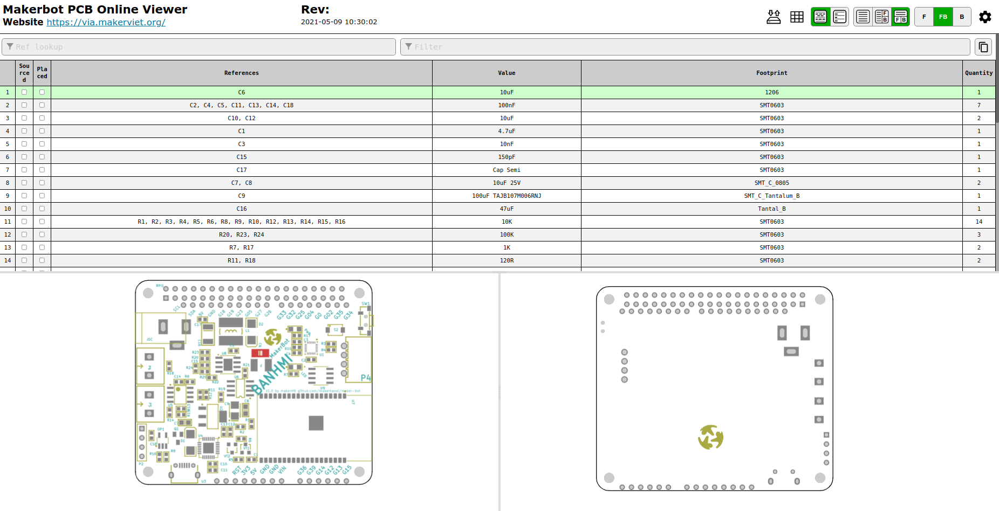

Giao diện xem mạch Makerbot online giúp các bạn quan sát các thành phần linh kiện của mạch Makerbot, từ layout của mạch, cách sắp xếp các thành phần linh kiện đến các tham số của từng linh kiện. Trang này có thể cung cấp các thông tin hữu ích cho các bạn khi hàn hoặc gỡ lôi mạch.

Truy cập tại địa chỉ sau: [https://via.makerviet.org/en/docs/autonomous-on-hardware/online-pcb-viewer/ibom.html](https://via.makerviet.org/en/docs/autonomous-on-hardware/online-pcb-viewer/ibom.html).