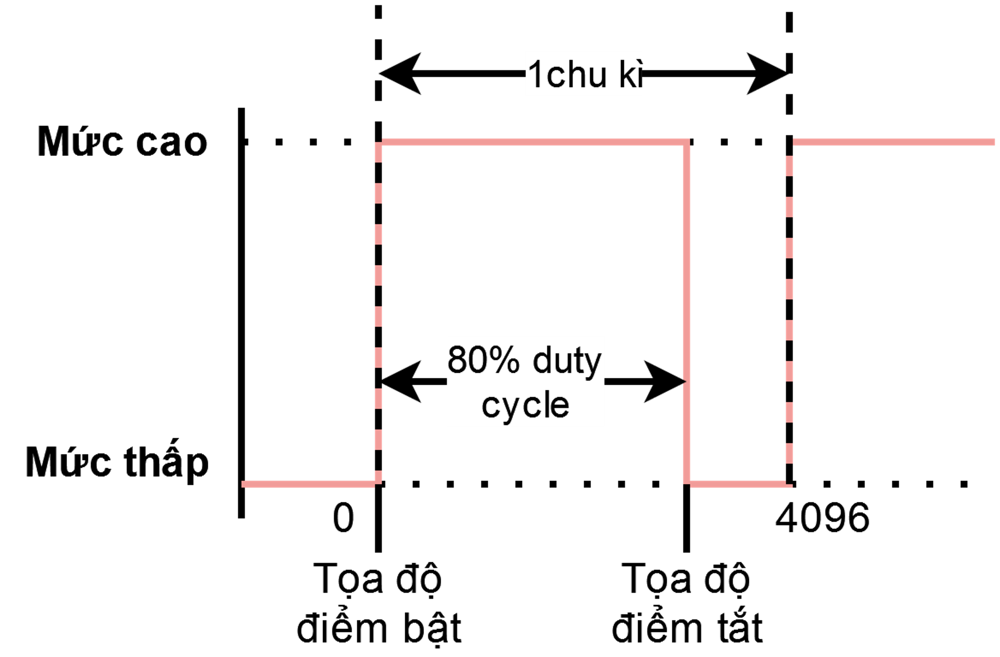

## Kết nối động cơ servo với mạch VIA

## Các bước khởi tạo

**Sử dụng thư viện Adafruit PCA9685:**
Link tải thư viện
*https://github.com/adafruit/Adafruit-PWM-Servo-Driver-Library*
Tài liệu
http://adafruit.github.io/Adafruit-PWM-Servo-Driver-Library/html/class_adafruit___p_w_m_servo_driver.html

**Ví dụ mẫu điều khiển servo:**
*File->examples->Adafruit-PWM-Servo-Driver-Library>servo*
**Ví dụ mẫu băm xung PWM:**
*File->examples->Adafruit-PWM-Servo-Driver-Library->PWMtest*
**Tài liệu tham khảo về PWM:**
*http://arduino.vn/reference/xung-pwm*

**Khai báo thư viện**
~~~
#include <Wire.h> //thư viện I2c của Arduino, do PCA9685 sử dụng chuẩn giao tiếp i2c nên thư viện này bắt buộc phải khai báo 
#include <Adafruit_PWMServoDriver.h> // thư viện PCA9685
~~~

**Khởi tạo class của thư viện với địa chỉ gốc**
~~~
Adafruit_PWMServoDriver pwm = Adafruit_PWMServoDriver();
~~~

Hoặc khởi tạo với địa chỉ tùy biến khi kết nối nhiều mạch
~~~
Adafruit_PWMServoDriver pwm1 = Adafruit_PWMServoDrive(0x70); 
Adafruit_PWMServoDriver pwm2 = Adafruit_PWMServoDrive(0x71);
~~~

**Khởi tạo trong hàm setup**
~~~
pwm.begin(); //khởi tạo PCA9685 
pwm.setOscillatorFrequency(27000000); // cài đặt tần số dao động 
pwm.setPWMFreq(50);// cài đặt tần số PWM. Tần số PWM có thể được cài đặt trong khoảng 24-1600 HZ, tần số này được cài đặt tùy thuộc vào nhu cầu xử dụng. Để điều khiển được cả servo và động cơ DC cùng nhau, tần số PWM điều khiển được cài đặt trong khoảng 50-60Hz.
Wire.setClock(400000); // cài đặt tốc độ giao tiếp i2c ở tốc độ cao nhất(400 Mhz). Hàm này có thể bỏ qua nếu gặp lỗi hoặc không có nhu cầu tử dụng I2c tốc độ cao
~~~

## Cấu trúc hàm băm xung pwm

~~~
pwm.setPWM(kênh PWM,toa độ bật, toa độ tắt); //toa độ trị bật, tọ//kênh PWM, kênh đầu ra có thế xem hình ở đầu slide và điền vào số kênh muốn điều khiển trong khoảng 0-15
a đổ điểm bắt đầu nâng mức logic lên cao 0-4095 (2^12) 
//giá trị bật quyết định tốc độ của động cơ (duty cycle), toa độ trị bắt, tọa đổ điểm kết thúc hạ nâng mức logic xuống thấp
~~~

**so sánh Hàm băm xung PWM với hàm analogWrite()**
~~~
pwm.setPWM(13 ,0, 255); // chọn chân số 13, giá trị pwm 255
 tương đương
analogWrite(13 , 255)
~~~
Hoặc
~~~
pwm.setPWM(13 ,0, 0); // chọn chân số 13, giá trị pwm 0
 tương đương
analogWrite(13 , 0)

pwm.setPWM(chan2, 0, val); 
pwm.setPWM(chan1, 4096, 0); //makerbot Sử dụng 2 kênh của PCA9685 , để điều khiển động cơ qua 1 chân luôn ở trạng thái tắt 
~~~
## Điều khiển động cơ DC bằng hàm băm xung PWM
Ví dụ: điều khiển động cơ số 1 tốc độ quay 50%, chiều quay thuận
~~~ 
pwm.setPWM(8, 0, 2048); //chân số 8 set chiều dương là PWM 50%
pwm.setPWM(9, 0, 0);    //chân số 9 set chiều âm 
//điều khiển kênh 8 và 9 của động cơ 1, tốc độ 50% = 4096/2 
~~~
Ví dụ: điều khiển động cơ số 1 tốc độ quay 75%, chiều quay ngịch
~~~ 
pwm.setPWM(8, 0, 0);    //chân số 8 set chiều âm 
pwm.setPWM(9, 0, 2730); //chân số 9 set chiều dương là PWM 75%
//điều khiển kênh 8 và 9 của động cơ 1, tốc độ 75% = 4096/1.5
~~~

## Ví dụ mẫu điều khiển động cơ qua Wifi
https://github.com/makerviet/maker-bot/tree/main/firmware/Maker_bot_motor_test

Bạn có thể sử dụng ví dụ mẫu trên để kiểm tra hoạt động của mạch VIA và các động cơ. Trong ví dụ, mạch VIA sẽ tạo 1 webserver trong mạng local, bạn có thể truy cập vào trang web đó để điều khiển tốc độ, chiều quay, góc quay của tất cả các động cơ DC và servo.