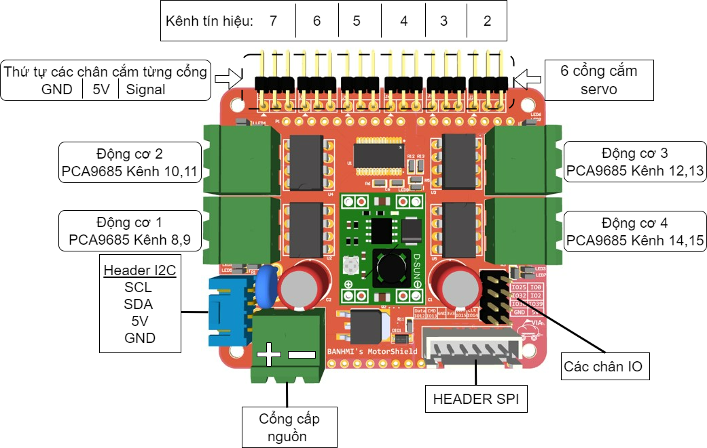

## Kết nối động cơ servo với mạch VIA
Bạn có thể kết nối động cơ vào 1 trong 6 cổng servo trên mạch công suất
**Lưu ý:** ghi nhớ kênh PWM của các cổng servo

## Các bước khởi tạo
Để điều khiển động cơ servo, chúng ta vẫn sử dụng thư viện Adafruit_PWMServoDriver và thực hiện các bước khởi tạo tương tự động cơ DC thường đã hướng dẫn ở bài trước. Lưu ý sử dụng xung PWM ở tần số 50Hz.

```
pwm.setPWMFreq(50);
```

Cách điều khiển góc (đối với Servo 180) dựa theo độ rộng xung bật như hình bên

Đối với Servo 360 ta không điều khiển được góc mà chỉ điều khiển được tốc độ quay và chiều quay dựa vào độ rộng xung bật tương tự như servo 180

## Điều khiển servo sử dụng hàm băm xung PWM
Tính độ giá trị PWM dựa theo thời gian ví dụ ở góc 180 độ

```
pwm_val = T_on/(Ts/4096) = 2/(20/4096) = 409.6
```

Vậy để set góc 180 độ ta cần sử dụng:

```
pwm.setPWM(5, 0, 410); // chọn kênh servo số 5
```

## Điều khiển sử dụng hàm set thời gian
Đưa vào giá trị thời gian chính xác ở đơn vị micro giây

```
pwm.writeMicroseconds(kênh PWM, microsec); //Microsec, thời gian xung ở mức cao trong 1 chu kì (trạng thái bật)
```

Ví dụ set góc 180 độ:

```
pwm.writeMicroseconds(5, 2000); // chọn kênh servo số 5
```
## Ví dụ mẫu điều khiển động cơ qua Wifi
https://github.com/makerviet/maker-bot/tree/main/firmware/Maker_bot_motor_test

Bạn có thể sử dụng ví dụ mẫu trên để kiểm tra hoạt động của mạch VIA và các động cơ. Trong ví dụ, mạch VIA sẽ tạo 1 webserver trong mạng local, bạn có thể truy cập vào trang web đó để điều khiển tốc độ, chiều quay, góc quay của tất cả các động cơ DC và servo.