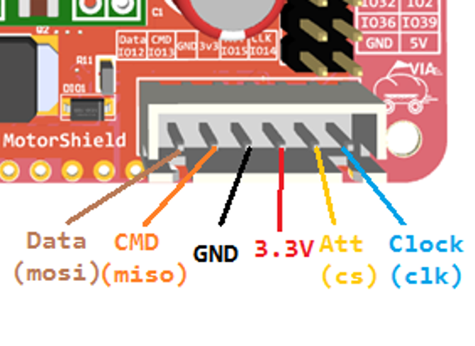
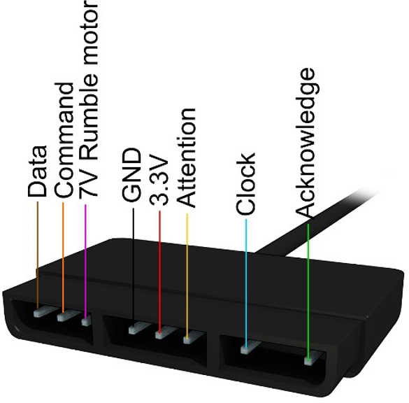
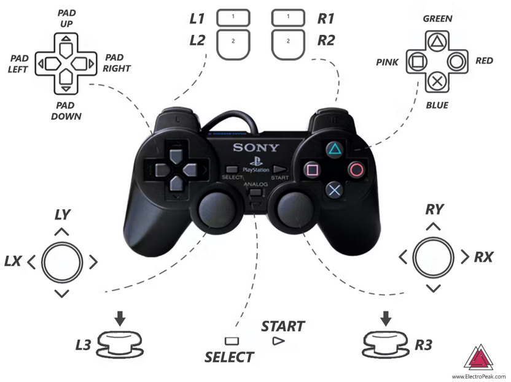
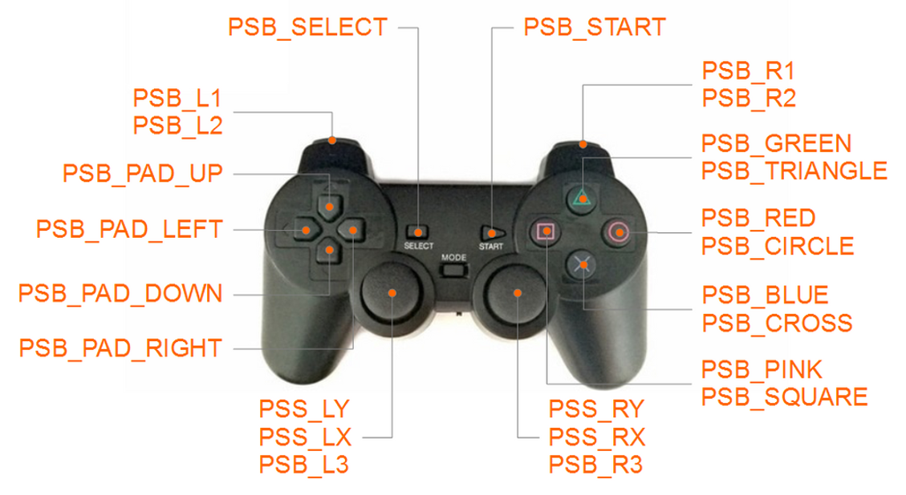
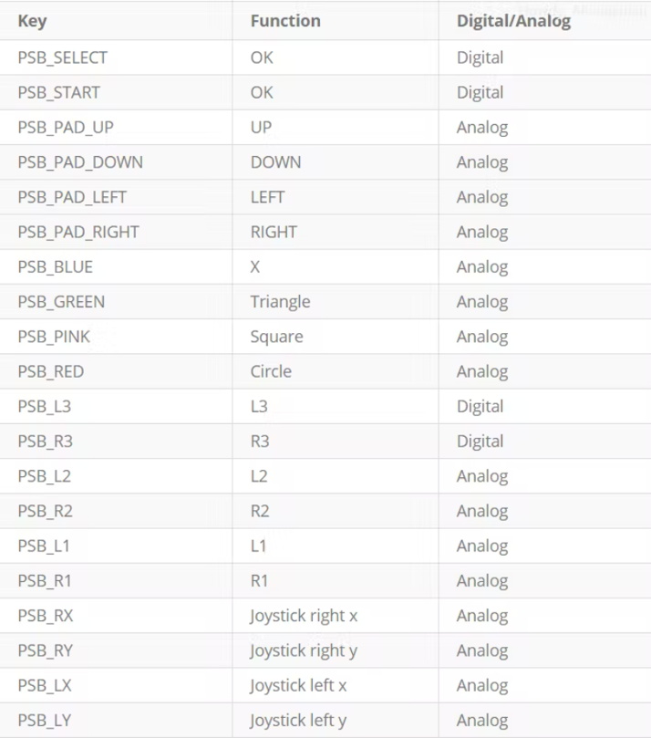

## Tổng quan
Có nhiều phương pháp để truyền tín hiệu điều khiển tới mạch VIA, từ đó lập trình để điều khiển robot. Ở bài hướng dẫn này, chúng tôi sẽ giới thiệu một phương pháp thường được dùng phổ biến trong các cuộc thi robot như Vietnam Robotics Challenge, đó là sử dụng bộ gamepad RF.


Bộ gamepad bao gồm 1 tay điều khiển và 1 bộ thu tín hiệu RF. Tín hiệu điều khiển được truyền từ tay điều khiển tới bộ thu tín hiệu thông qua sóng radio, sau đó có thể được truyền từ bộ thu vào mạch VIA thông qua giao thức SPI.

## Kết nối bộ thu với mạch VIA



Sử dụng dây jumper để kết nối các chân SPI theo tiêu chuẩn từ bộ thu vào header SPI trên mạch VIA.

*Lưu ý: có 2 chân ta không sử dụng là  chân số 3 (Rumble motor) và chân số 7 (Acknowledge)*

Sau khi kết nối bộ thu với mạch VIA và cấp nguồn cho mạch VIA, đèn báo nguồn trên bộ thu sẽ nhấp nháy. Gắn pin vào tay điều khiển và bật nguồn, bộ thu và tay điều khiển sẽ tự kết nối với nhau. Khi đèn báo nguồn và đèn báo Rx trên bộ thu ngừng nhấp nháy tức là đã kết nối thành công.

## Đọc tín hiệu từ gamepad
Tải và cài đặt thư viện Gamepad RF: 
https://github.com/makerhanoi/Arduino-PS2X-ESP32-Makerbot
Sau khi cài đặt thư viện, bạn có thể xem ví dụ mẫu điều khiển động cơ bằng Gamepad với mạch VIA đi kèm thư viện:
File->examples->Arduino-PS2X-ESP32-Makerbot>PS2X_Example_VIA_Makerbot_ESP32

## Bản đồ nút bấm và tín hiệu tương ứng




## Ví dụ mẫu
Tìm hiểu ví dụ đọc các nút bấm gửi từ tay điều khiển (PS2X_Example_VIA_Makerbot_ESP32) 

```
//Khai báo thư viện cho tay cầm
#include <PS2X_lib.h> // Khai báo thư viện

//Định nghĩa các chân điều khiển 
#define PS2_DAT 12 // MISO 
#define PS2_CMD 13 // MOSI 
#define PS2_SEL 15 // SS 
#define PS2_CLK 14 // SLK

//Khởi tạo class của thư viện
PS2X ps2x; // khởi tạo class PS2x

```
Bắt đầu kết nối trong hàm setup()
```
//Khởi tạo Serial monitor với tốc độ 115200
Serial.begin(115200);

//Kết nối với tay cầm bằng hàm ps2x.config_gamepad, thử kết nối lại trong vòng 10 lần nếu quá 10 lần không kết nối được với tay cầm thì sẽ dừng lại

int error = -1; 
for (int i = 0; i < 10; i++) // thử kết nối với tay cầm ps2 trong 10 lần 
{
  delay(1000); // đợi 1 giây 
  // cài đặt chân và các chế độ: GamePad
  error = ps2x.config_gamepad(PS2_CLK, PS2_CMD, PS2_SEL, PS2_DAT, pressures, rumble); 
  Serial.print("."); 
  if(!error) //kiểm tra nếu tay cầm đã kết nối thành công 
	break; // thoát khỏi vòng lặp 
} 
```
Đọc giá trị tay điều khiển trong hàm hàm loop()
```
//Cập nhật các giá trị của tay điều khiển
ps2x.read_gamepad(false, false); // gọi hàm để đọc tay điều khiển 
```
Đọc nút bấm theo kiểu digital, True khi nhấn, False khi không nhấn
```
// các trả về giá trị TRUE (1) khi nút được giữ 
if (ps2x.Button(PSB_START)) // nếu nút Start được giữ, in ra Serial monitor 	Serial.println("Start is being held");
```
Đọc nút bẩm theo kiểu Analog, lấy giá trị độ lớn, ấn mạnh hay nhẹ
```
if (ps2x.Button(PSB_PAD_UP)) // tương tự như trên kiểm tra nút Lên (PAD UP) 
{ 
   Serial.print("Up held this hard: ");     
   Serial.println(ps2x.Analog(PSAB_PAD_UP), DEC); // đọc giá trị analog ở nút   
   này, xem nút này được bấm mạnh hay nhẹ 
}
```
Đọc nút bấm theo sự thay đổi trạng thái (bật, bật hoặc tắt, tắt)
```
if (ps2x.ButtonPressed(PSB_CIRCLE)) // Trả về giá trị TRUE khi nút được ấn (từ tắt sang bật) 
   Serial.println("○ just pressed"); 
if (ps2x.NewButtonState(PSB_CROSS)) // Trả về giá trị TRUE khi nút được thay đổi trạng thái (bật sang tắt, hoặc tắt sang bật) 
   Serial.println("× just changed"); 
if (ps2x.ButtonReleased(PSB_SQUARE)) // Trả về giá trị TRUE khi nút được thả ra (từ bật sang tắt) 
   Serial.println("□ just released"); 

//Đọc nhiều nút bấm theo sự thay đổi trạng thái
if (ps2x.NewButtonState()) {
  if (ps2x.Button(PSB_L3)) Serial.println("L3 pressed");
  if (ps2x.Button(PSB_R3)) Serial.println("R3 pressed"); 
  if (ps2x.Button(PSB_L2)) Serial.println("L2 pressed");
  // Trả về giá trị TRUE khi nút được thay đổi trạng thái (bật sang tắt, hoặc tắt sang bật)
}
```
Đọc giá trị joystick
```
Serial.print("Stick Values:"); 
Serial.print(ps2x.Analog(PSS_LY)); // đọc trục Y của joystick bên trái. 
Serial.print(","); Serial.print(ps2x.Analog(PSS_LX), DEC); Serial.print(","); Serial.print(ps2x.Analog(PSS_RY), DEC); Serial.print(","); Serial.println(ps2x.Analog(PSS_RX), DEC);
```