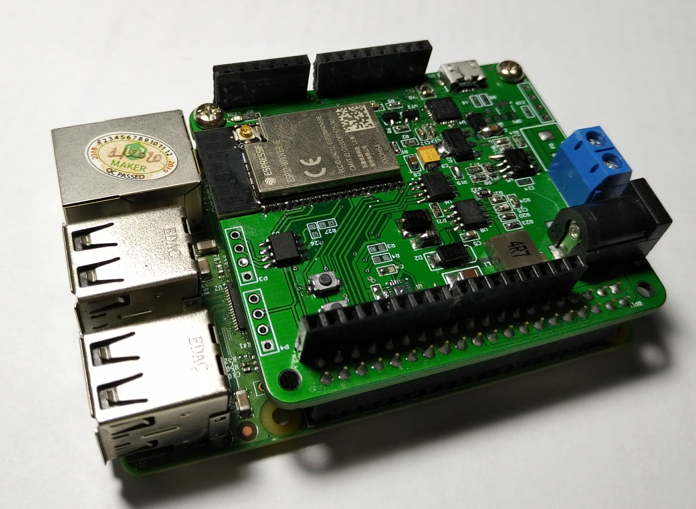
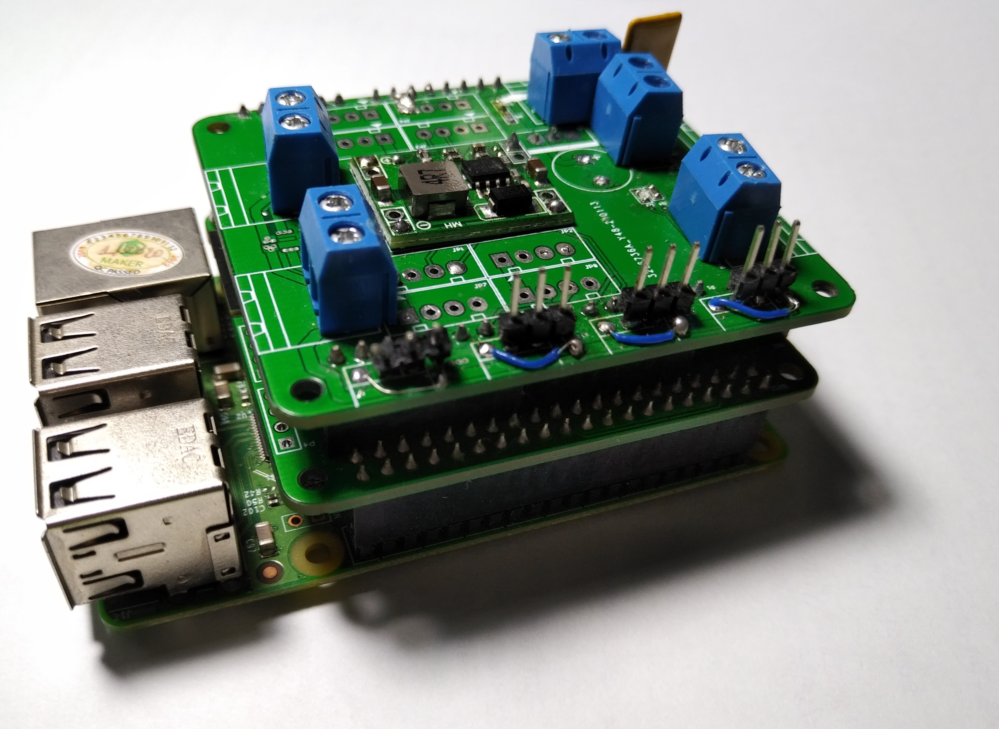
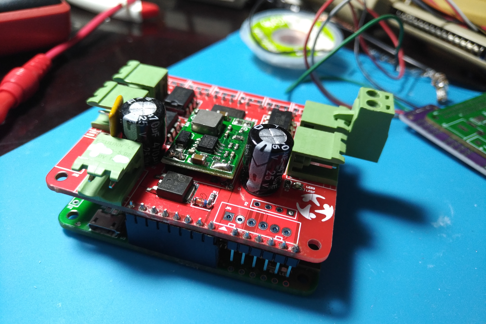

**Thiết kế phần cứng:** <https://github.com/makerhanoi/maker-bot>.

**Chú ý:** Thiết kế phần cứng đang được tích cực kiểm thử và cải tiến. Đây chưa phải thiết kế tối ưu nhất mang chúng tôi đề xuất.

Mạch Makerbot bao gồm các thành phần sau: WiFI, BLE, 9 DOF IMU, CAN, RS485, tương thích được tối đa 6 Servo và 4 DC motor.

### Linh kiện

Chúng tôi lựa chọn linh kiện dựa trên cân bằng về giá cả, chất lượng và sự phổ biến để mọi người đều có thể tiếp cận với sản phẩm cuối cùng.

- ESP32-WROVER-IE(16MB)
- MPU-9250, 9 DOF IMU
- SN65HVD230 CAN transceiver
- MAX3485
- PCA9685 16 channel PWM driver
- DRV8841 H-Bridge
- DS3231MZ+ RTC

### Known issues

- WiFI signal strength issue
- Pull up resistor on IO2 causing ESP32 cannot reset properly, Do not populate R15
- Rs485 issue
- cannot read magnetometer MPU9250
- Motorshield power issue

### TODO

- Redesign motorshield
- Add pins name to Silkscreen
- Fix known issues in next revision