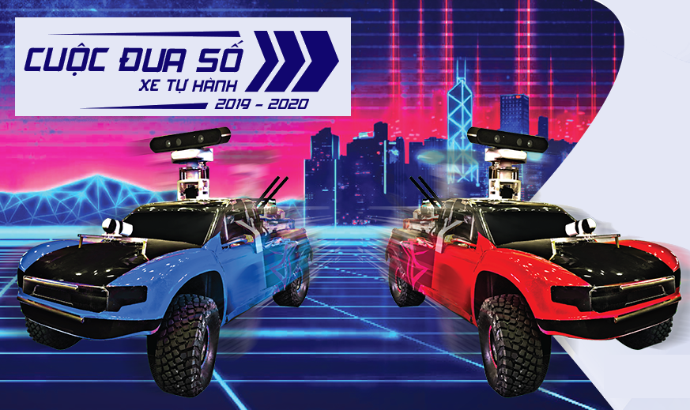
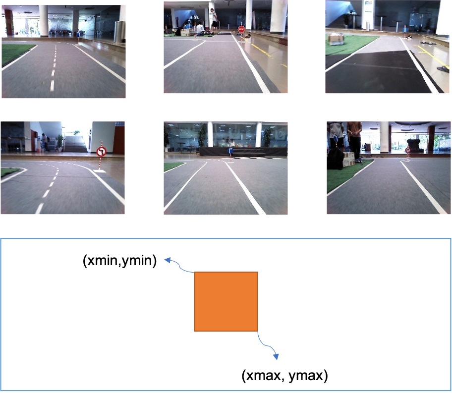
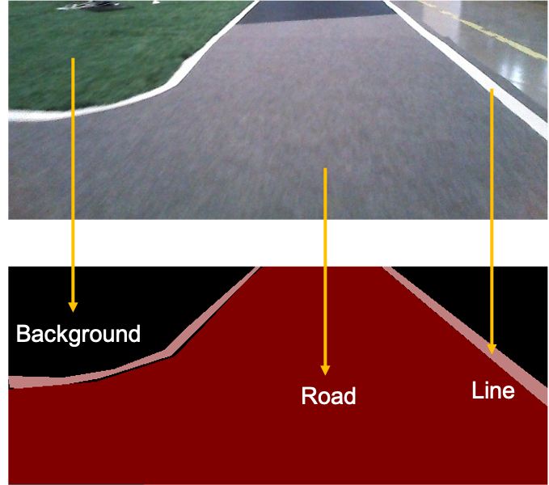

The dataset shared here is used to train the model for the team playing **Goodgame**, winning the [Digital Race](https://cuocduaso.fpt.com.vn/en) - Contest self-driving car programming for students in 2020. Each team's task is to train and optimize AI models, and at the same time integrate them on a self-driving car model using NVIDIA's Jetson TX2 board to follow. in the designated lanes, follow directional signs and avoid obstacles on the road. The **Goodgame** team, with a lot of talent and effort, won the championship. **Goodgame** captain Dat Vu helped share the source code and the data you used to train your AI models.



## 1. Link to download data

The data is divided into two main tasks: Sign detection and lane detection.

* [Data for sign detection](https://drive.google.com/file/d/1NGrKWHc1z_4bOh2huWHC8kZsUZFXOku-/view)
* [Data for lane segment](https://drive.google.com/file/d/1X-onXnGbrIwuXTt03rK-6FV3w2bGNyK8/view?usp=sharing)

## 2. Information about data

The data for sign detection is structured as follows:

```
Object Detection
    Data
         |───000000_10.png
         |───000001_10.png
         |───...
    │─── test.csv
    train.csv
```

This dataset includes **12,764** images in the training set - training set and **2,561** images in the monitoring set - validation set, with 6 classes of signs:

- Turn left
- Turn right
- Go straight
- Stop
- No Turn Left
- No Turn Right

The labels of the dataset are contained in `.csv` files with the following structure:

| filename | xmin | ymin | xmax | ymax | class_id |
| -------- | -------- | -------- | -------- | -------- | -------- |
| 00072.jpg | 148 | 53 | 159 | 63 | 4 |



### Lane Segment Dataset:

Directory structure:
```
Segmentation
    GGDataSet
         |─── train_frames
             |─── train
                 |─── train_000001.png
         |─── train_masks
             |─── train
                 |─── train_000001.png
         |─── val_frames
             |─── val
                 |─── val_000001.png
         |─── val_masks
             |─── val
                 |─── val_000001.png
         |─── label_colors.txt
    │─── model_pb
    models
    train.py
    │─── convert_pb.py
```

The data set includes **6240** images in the training set - training set and **1448** images in the monitoring set - validation set, including segment labels for 3 layers: **Background**, **Road lines** and **Road**.




## 3. Source code

Those interested can see the notebooks for training deep learning networks using these datasets at the following link: <https://github.com/makerhanoi/via-dataset>. **Goodgame** also shares their source code to the community at [here](https://github.com/datvuthanh/Digital-Race). 