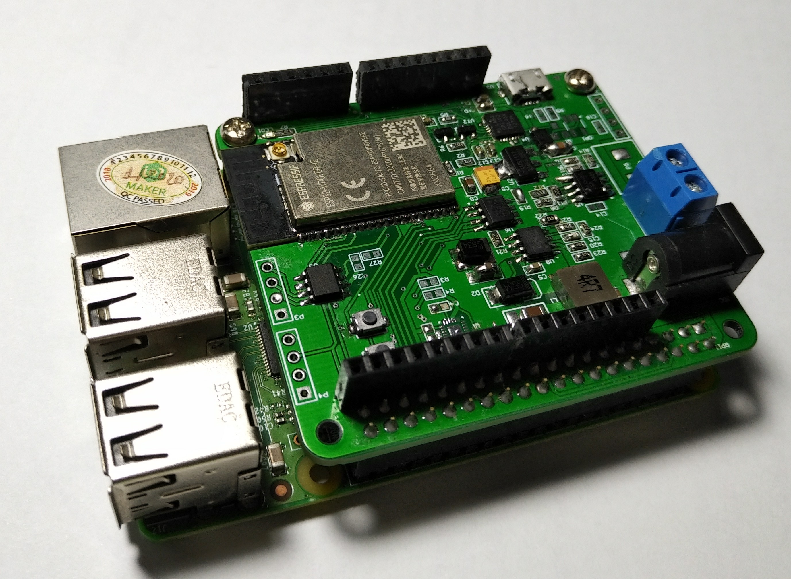
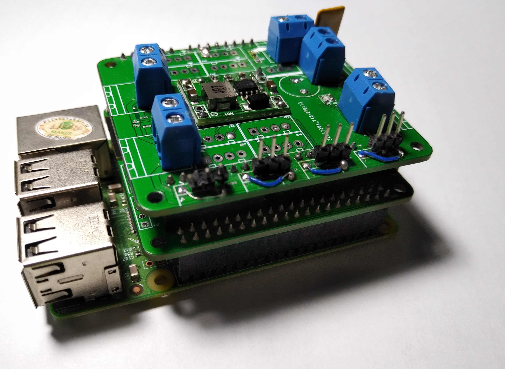
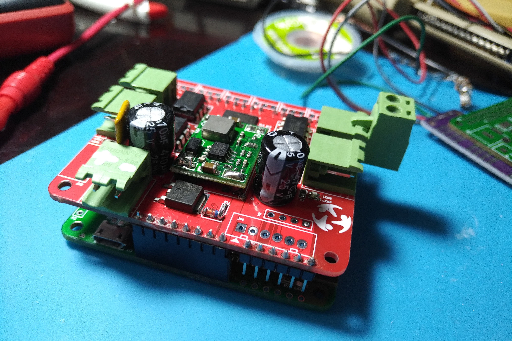

**Hardware Design:** <https://github.com/makerhanoi/maker-bot>.

**Note:** The hardware design is being actively tested and improved. This is not the most optimal design we recommend.

The Makerbot circuit includes the following components: WiFI, BLE, 9 DOF IMU, CAN, RS485, compatible with up to 6 Servos and 4 DC motors.

### Accessories

We select components based on a balance of price, quality and popularity so that the end product is accessible to everyone.

- ESP32-WROVER-IE (16MB)
- MPU-9250, 9 DOF IMU
- SN65HVD230 CAN transceiver
- MAX3485
- PCA9685 16 channel PWM driver
- DRV8841 H-Bridge
- DS3231MZ+ RTC

### Known issues

- WiFi signal strength issue
- Pull up resistor on IO2 causing ESP32 cannot reset properly, Do not populate R15
- Rs485 issue
- cannot read magnetometer MPU9250
- Motorshield power issue

### TODO

- Redesign motorshield
- Add pins name to Silkscreen
- Fix known issues in next revision