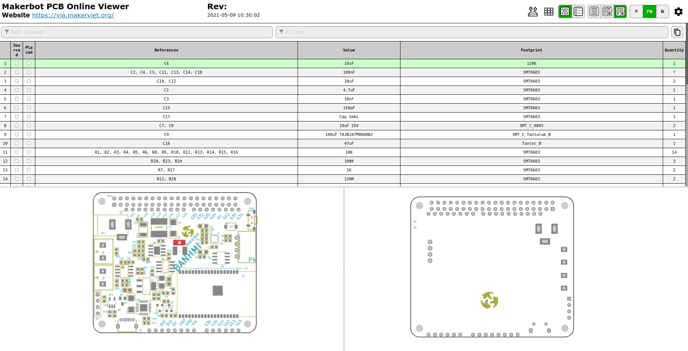

The Makerbot online circuit viewing interface helps you observe the components of the Makerbot circuit, from the layout of the circuit, the arrangement of components to the parameters of each component. This page can provide you with useful information when soldering or removing a short circuit.

Accessed at the following address: [https://via.makerviet.org/en/docs/hardware/online-pcb-viewer/ibom.html](/vi/docs/hardware/online-pcb-viewer/ibom. html).