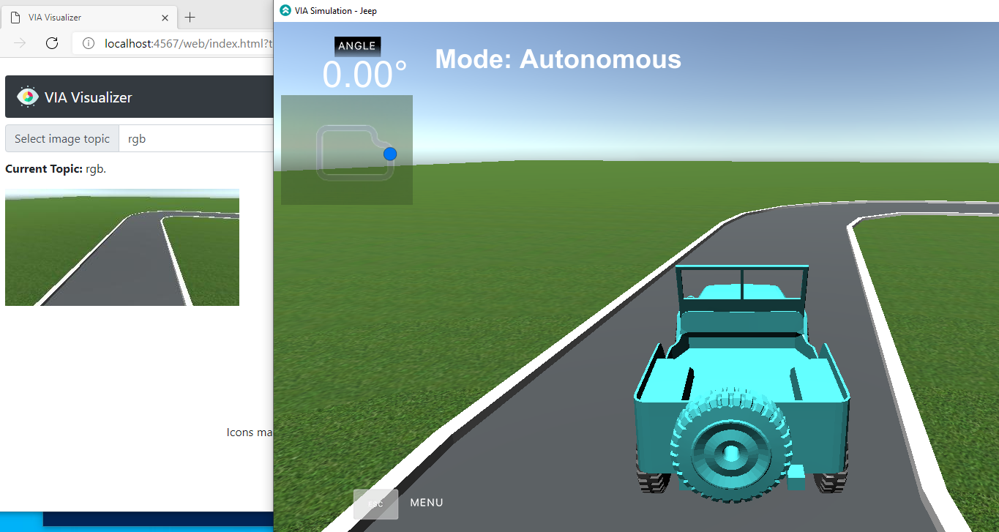
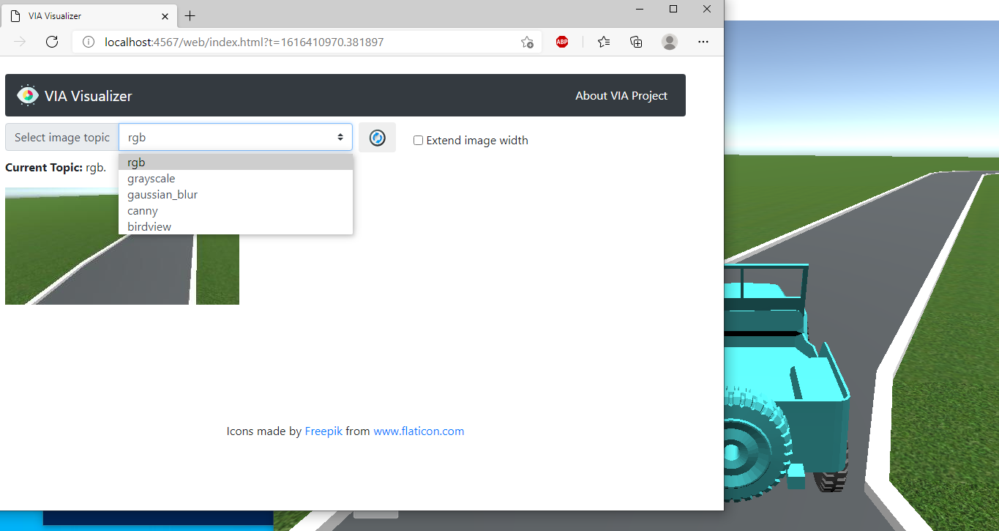
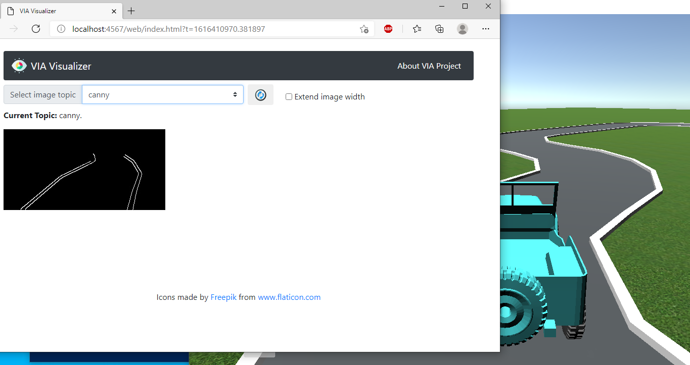

Ở phần này, chúng ta sẽ tìm hiểu cách để tự mình tạo một bản đồ mới theo ý muốn và chạy xe ở chế độ tự hành trên bản đồ đó trong giả lập Via Simulation.
## I. Tạo bản đồ mới

Tại giao diện mở đầu của trình giả lập, chọn **Design Map**.


Giao diện thiết kế bản đồ có thể được chia làm 4 phần chính như hình sau:

- **(1)** Tùy chỉnh nền của bản đồ (nền đất hoặc nền cỏ)
- **(2)** Các khối (block) mô phỏng lòng đường đã được thiết kế sẵn. Chúng ta có thể kéo thả các khối này và ghép nối chúng để tạo thành bản đồ hoàn chỉnh theo ý muốn
- **(3)** Các nút lệnh cơ bản
    - ***Rotate*** (phím tắt R): xoay các khối
    - ***Erase*** (phím tắt E): xóa một khối nào đó
    - ***Clear***: xóa toàn bộ các khối
    - ***Car***: chọn vị trí khởi hành của xe trên bản đồ (sau khi đã thiết kế xong)
    - ***Save map, Load map***: lưu bản đồ hiện tại hoặc mở một bản đồ đã được lưu
    - ***GO***: bắt đầu chạy xe

**(4)**: không gian thiết kế: chúng ta sẽ kéo thả các khối vào đây

Mình sẽ thử tạo một bản đồ như hình sau bằng cách kéo thả và ghép các khối lòng đường lại với nhau. Sau khi ghép xong mình nhấn nút **Car** và đặt xe vào vị trí mà mình muốn khởi hành.


Sau khi thiết kế xong, mình chọn **Save map**, điền tên bản đồ và chọn **OK** để lưu lại bản đồ.


## II. Chạy xe tự hành trên bản đồ đã tạo

Tại giao diện mở đầu của trình giả lập, chọn **Start**.


Chọn một bản đồ đã tạo và nháy **OK** để bắt đầu trình giả lập.


Tiếp đến, để xe có thể chạy ở chế độ tự hành, chúng ta mở thư mục chứa source code `hello-via-master` đã tải về, giữ phím Shift, nhấn chuột phải và chọn **Open PowerShell window here** để mở cửa sổ dòng lệnh:


Tại cửa sổ PowerShell, chúng ta sẽ kích hoạt môi trường python ảo đã tạo ở hướng dẫn trước sử dụng lệnh

```
conda activate [tên môi trường]
```


Chạy file `drive.py` để kích hoạt chế đô tự hành, sử dụng lệnh:

```
python drive.py
```

Click chuột trở lại cửa sổ của trình giả lập, xe sẽ tự động chạy trên bản đồ đã tạo.

## III. Kiểm thử và gỡ lỗi

Để phục vụ cho việc kiểm thử và gỡ lỗi thuật toán tự hành, chúng ta cần trích xuất hình ảnh sau khi được xử lí ở từng bước trong thuật toán theo thời gian thực. (Xem lại bài bài [Hello VIA!](/vi/docs/getting-started/hello-via/) để hiểu về các bước trong thuật toán xử lí ảnh cho xe tự hành)

**VIA Visualizer** sẽ giúp chúng ta thực hiện điều trên. Sau khi chạy file `drive.py`, mở trình duyệt web và nhập địa chỉ sau:

[http://localhost:4567](http://localhost:4567)

Chúng ta sẽ thấy hình ảnh từ giả lập đã qua thuật toán xử lí được hiển thị theo thời gian thực ngay trên trình duyệt.


Chúng ta có thể lựa chọn hình ảnh muốn xem được trích xuất tại bước nào của thuật toán tại menu ***Select image topic***. Ví dụ, ở hình dưới mình đang xem hình ảnh khi đã qua bước phát hiện cạnh canny.





Chúc các bạn thành công sáng tạo và thử nghiệm được các bản đồ của riêng mình!

