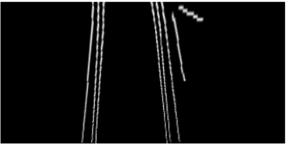
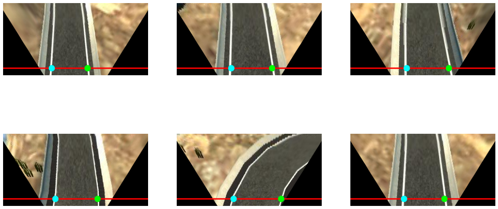

Xe tự lái đã từ một công nghệ tương lai trở thành một lĩnh vực nghiên cứu tiên tiến và gần đây, nó đã trở thành một tính năng hấp dẫn trong nhiều phương tiện thương mại. Sớm thôi chúng ta sẽ thấy xe tự lái tràn ngập đường. Trong bài đăng trên blog này, chúng tôi sẽ cung cấp cho bạn một hướng dẫn về hệ thống tự lái. Bạn sẽ tìm hiểu về xử lý ảnh cơ bản để phát hiện đường làn và mạng nơ-ron tích chập để phát hiện biển báo giao thông, và áp dụng các thuật toán này để điều khiển xe tự lái trong mô phỏng được thiết kế vởi nhóm VIA.

**Yêu cầu đầu vào:** Hướng dẫn này mặc định các bạn đã biết Python. Nếu chưa biết về ngôn ngữ này, các bạn có thể truy cập [trang sau](https://www.howkteam.vn/course/lap-trinh-python-co-ban-37) để học Python trước.


**Trên đây là chiếc xe tự lái bạn sẽ xây dựng được sau khi đọc xong bài viết này**

Trước khi đọc hướng dẫn này, bạn cần một chút kiến thức cơ bản về Python, chẳng hạn như khái niệm về dữ liệu, biến số, rẽ nhánh, vòng lặp, hàm và một số kiến thức về xử lý ảnh cơ bản với OpenCV. Với Python, bạn có thể học qua [khoá học sau](https://howkteam.vn/course/lap-trinh-python-co-ban-37).Đừng lo lắng nếu bạn chưa có bất kỳ kinh nghiệm nào với OpenCV. OpenCV khá dễ học và tôi sẽ giới thiệu cho bạn những kiến thức cơ bản để có thể bắt đầu.

**Hướng dẫn này bao gồm ba phần:**

- Phần 1: Lọc đường làn. Bạn sẽ áp dụng biến đổi không gian màu, bộ lọc Gaussian và thuật toán phát hiện biên Canny để lọc đường làn từ ảnh màu.
- Phần 2: Điều khiển xe của bạn. Dựa trên thuật toán được giới thiệu trong phần 1, chúng ta sẽ phát triển một thuật toán để điều khiển chiếc xe của bạn trong mô phỏng VIA. [Xem Mô phỏng VIA](https://via-sim.makerviet.org/).
- Phần 3: Phát hiện biển báo giao thông. Phần này sẽ phát triển một bộ phát hiện biển báo giao thông sử dụng bộ lọc màu và huấn luyện mô hình trí tuệ nhân tạo để phân loại biển báo.

Sau khi học tất cả ba phần, bạn sẽ có thể áp dụng những kỹ năng đã được giới thiệu để xây dựng, kiểm tra và trải nghiệm chiếc xe tự lái đầu tiên của bạn với nhiều bản đồ trong mô phỏng của chúng tôi.

## 1. Phát hiện vạch kẻ đường

Phát hiện vạch kẻ đường là một tính năng thông minh có mặt trong nhiều loại xe hiện nay, cho phép phương tiện phát ra cảnh báo khi tài xế đi ra khỏi làn đường một cách không cố ý hoặc giúp duy trì vị trí ở trung tâm làn đường (giữ làn). Trong hướng dẫn này, chúng ta sẽ phát triển một thuật toán đơn giản để lọc vạch kẻ đường từ các hình ảnh. Thuật toán của chúng ta bao gồm ba bước: chuyển đổi hình ảnh sang ảnh xám, loại bỏ nhiễu bằng bộ lọc Gaussian và áp dụng bộ phát hiện biên Canny để tìm vạch kẻ đường từ hình ảnh.


Chúng tôi đã chuẩn bị một sổ ghi Colab cho bạn thử nghiệm các thuật toán mà không cần các bước phức tạp để cài đặt các phần mềm tại máy tính cá nhân. [Mở sổ ghi Colab](https://www.google.com/url?q=https://colab.research.google.com/github/makerviet/hello-via/blob/master/notebooks/Lane-Line-Detection.ipynb&sa=D&source=editors&ust=1687371449455330&usg=AOvVaw3ZULLqNtHSqElJjrJb8qvp).

Không gian màu phổ biến nhất trong OpenCV là BGR, tất cả các pixel màu trong một hình ảnh từ ba thành phần màu cơ bản (B - xanh lam, G - xanh lá cây và R - đỏ). Tuy nhiên, chúng ta chỉ cần hình ảnh xám cho thuật toán phát hiện vạch kẻ đường đơn giản, vì vậy chúng ta chuyển đổi các hình ảnh từ không gian màu BGR sang ảnh xám. Bước này có thể được thực hiện chỉ với một dòng lệnh trong OpenCV:

```python
gray = cv2.cvtColor(img, cv2.COLOR_BGR2GRAY)
```


**Hình ảnh ban đầu**


**Ảnh xám sau khi đã chuyển đổi**

Bạn có thể đọc thêm về các không gian màu khác trong OpenCV từ [blog sau](https://aicurious.io/blog/2018-09-19-anh-so-va-cac-khong-gian-mau-trong-xu-ly-anh). Sau khi chuyển đổi màu, chúng ta cần thực hiện một bước tiền xử lý khác: loại bỏ nhiễu. Nhiễu trong các hình ảnh chụp có thể gây ra kết quả không tốt cho các thuật toán xử lý hình ảnh. Người ta thường sử dụng bộ lọc để giảm nhiễu, chẳng hạn như bộ lọc trung bình, trung vị, Gaussian hoặc bilateral ([thêm chi tiết](https://aicurious.io/blog/2018-09-29-loc-anh-image-filtering)). Trong bước 2, chúng tôi sử dụng bộ lọc Gaussian như dưới đây. Bạn có thể thử cải thiện kết quả lọc nhiễu bằng cách thay đổi các tham số hoặc thậm chí thay thế Gaussian bằng các bộ lọc khác.

```python
img_gauss = cv2.GaussianBlur(gray, (11, 11), 0)
```


**Hình ảnh sau khi lọc**

Bước cuối cùng của việc phát hiện vạch kẻ đường là sử dụng thuật toán Canny để tìm các đường biên trong ảnh.

```python
thresh_low = 150
thresh_high = 200
img_canny = cv2.Canny(img_gauss, thresh_low, thresh_high)
```


**Hình ảnh kết quả sau khi đi qua thuật toán Canny**

`thresh_low` và `thresh_high` là hai tham số chúng ta cần điều chỉnh cho thuật toán Canny để hoạt động trong các tình huống cụ thể của hình ảnh, chẳng hạn như chất lượng của hình ảnh và độ rõ nét của các đường nét trong ảnh.

Ba hàm OpenCV được giới thiệu ở trên đã đủ cho chúng ta để xây dựng một luồng lọc vạch kẻ đường. Hãy viết hàm `find_lane_lines()`, nhận một hình ảnh làm đầu vào và tự động lọc vạch kẻ đường.

```python
def find_lane_lines(img):
    """
    Detecting road markings
    This function will take a color image, in BGR color system,
    Returns a filtered image of road markings
    """
    # Convert to gray scale
    gray = cv2.cvtColor(img, cv2.COLOR_BGR2GRAY)

    # Apply a Gaussian filter to remove noise
    # You can experiment with other filters here.
    img_gauss = cv2.GaussianBlur(gray, (11, 11), 0)

    # Apply Canny edge detection
    thresh_low = 150
    thresh_high = 200
    img_canny = cv2.Canny(img_gauss, thresh_low, thresh_high)
    cv2_imshow(img_canny)

    # Return image
    return img_canny
```

## 2. Điều khiển xe với thuật toán phát hiện vạch kẻ đường

Sau khi xây dựng bộ lọc đường đường, chúng ta áp dụng các bước khác để tìm góc điều khiển, tốc độ và điều khiển xe chạy trên giả lập.

### Biến đổi góc nhìn birdview

Thông thường, camera được đặt ở góc nhìn chéo so với bề mặt đường. Điều này gây khó khăn trong việc ước lượng và tính toán góc lái cho xe. Do đó, chúng ta sẽ thay đổi phối cảnh của hình ảnh từ góc chéo thành góc đứng vuông góc với bề mặt đường bằng cách sử dụng bức ảnh biến đổi tầm nhìn từ góc của chim (bird-view transform).

Một kỹ thuật thú vị trong thị giác máy tính cho phép chúng ta tìm ra các thông số biến đổi bằng việc tính toán sự thay đổi vị trí của 4 điểm theo các góc nhìn khác nhau. Sau đó, chúng ta sử dụng `cv2.warpPerspective()` để áp dụng biến đổi đó cho bất kỳ hình ảnh nào.

Đọc thêm về  **perspective transform** tại: <https://www.pyimagesearch.com/2014/08/25/4-point-opencv-getperspective-transform-example/>.

Dưới đây là mã cài đặt cho haàm biến đổi của chúng ta. Bạn có thể thử nghiệm với sổ tay Colab.s

```
def birdview_transform(img):
    IMAGE_H = 160
    IMAGE_W = 320

    # 4 điểm ảnh tương trên ảnh gốc
    src = np.float32([[0, IMAGE_H], [320, IMAGE_H], [0, IMAGE_H//3], [IMAGE_W, IMAGE_H//3]])

    # 4 điểm ảnh tương ứng trên ảnh biến đổi (góc nhìn từ trên xuống)
    dst = np.float32([[90, IMAGE_H], [230, IMAGE_H], [-10, 0], [IMAGE_W+10, 0]])

    M = cv2.getPerspectiveTransform(src, dst) # The transformation matrix
    warped_img = cv2.warpPerspective(img, M, (IMAGE_W, IMAGE_H)) # Image warping

    return warped_img
```



Kết quả khi áp dụng biến đổi góc nhìn từ trên xuống. Chúng ta sẽ thấy các vạch kẻ đường song song khi xe ở giữa làn đường.

### Tìm điểm trái/phải

After obtaining a bird-view image, a simple method to help 
Sau khi có được một hình ảnh góc nhìn từ trên xuống, một phương pháp đơn giản để giúp xác định vị trí của xe so với làn đường là tìm hai điểm, một trên vạch kẻ đường bên trái và một trên vạch kẻ đường bên phải. Cuối cùng, chúng ta xem xét vị trí của điểm giữa của xe so với hai điểm đó để xác định sự lệch của xe khỏi làn đường và tính toán góc lái phù hợp.


Đoạn mã dưới đây sẽ xem xét một đường thẳng ngang (interested_line) trong hình ảnh. Từ vị trí trung tâm của hình ảnh, chúng ta duyệt qua hai bên, tìm các pixel có giá trị khác không (0) đầu tiên và coi chúng là vị trí của các vạch kẻ đường bên trái và bên phải. Chúng ta đã xác định trước chiều rộng làn đường lane_width = 100, vì vậy chúng ta có thể sử dụng giá trị này để tìm một trong hai điểm trái/phải khi chỉ có một điểm còn lại được nhìn thấy.

```python
def find_left_right_points(image, drawFNone):
    """Find left and right points of lane
    """

    im_height, im_width = image.shape[:2]

    # Consider the position 70% from the top of the image
    interested_line_y = int(im_height * 0.9)

    if draw is not None:
        cv2.line(draw, (0, interested_line_y),
                 (im_width, interested_line_y), (0, 0, 255), 2)
    interested_line = image[interested_line_y, :]

    # Detect left/right points
    left_point = -1
    right_point = -1

    lane_width = 100
    center = im_width // 2

    # Traverse the two sides, find the first non-zero value pixels, and
    # consider them as the position of the left and right lines
    for x in range(center, 0, -1):
        if interested_line[x] > 0:
            left_point = x
            break

    for x in range(center + 1, im_width):
        if interested_line[x] > 0:
            right_point = x
            break

    # Predict right point when only see the left point
    if left_point != -1 and right_point == -1:
        right_point = left_point + lane_width

    # Predict left point when only see the right point
    if right_point != -1 and left_point == -1:
        left_point = right_point - lane_width

    # Draw two points on the image
    if draw is not None:
        if left_point != -1:
            draw = cv2.circle(
                draw, (left_point, interested_line_y), 7, (255, 255, 0), -1)
        if right_point != -1:
            draw = cv2.circle(
                draw, (right_point, interested_line_y), 7, (0, 255, 0), -1)

    return left_point, right_point
```



**Kết quả tìm điểm trái/phải được chiếu lên hình ảnh màu góc nhìn từ trên xuống.**

### Tính toán góc lái

Hàm tính toán tín hiệu điều khiển `calculate_control_signal()` được sử dụng để tính toán tốc độ và góc lái cho xe dựa trên hình ảnh đầu vào. Sau bước `find_land_lines()` sử dụng Canny để tìm kiếm các vạch kẻ đường, hình ảnh sẽ được truyền qua `birdview_transform()` để thực hiện biến đổi góc nhìn từ trên xuống, lấy góc nhìn từ trên xuống. Tiếp theo là thuật toán để tìm các điểm trái/phải của làn hiện tại thông qua hàm `find_left_right_points()`. Từ hai điểm trái và phải, chúng ta có thể tính toán hoàn toàn sự lệch của xe khỏi mặt đường (xem xét camera ở giữa xe).

```python
def calculate_control_signal(img):
    """Calculate speed and steering angle
    """

    # Find left/right points
    img_lines = find_lane_lines(img)
    img_birdview = birdview_transform(img_lines)
    left_point, right_point, viz_img = find_left_right_points(img_birdview, draw=True)

    # Show debug image
    cv2.imshow("Result", viz_img)
    cv2.waitKey(1)

    # Calculate speed and steering angle
    # The speed is fixed to 50% of the max speed
    # You can try to calculate speed from turning angle
    throttle = 0.5
    steering_angle = 0
    im_center = img.shape[1] // 2

    if left_point != -1 and right_point != -1:
        # Calculate the deviation
        center_point = (right_point + left_point) // 2
        center_diff =  im_center - center_point

        # Calculate steering angle
        # You can apply some advanced control algorithm here
        # For examples, PID
        steering_angle = - float(center_diff * 0.01)

    return throttle, steering_angle
```

### Test thực tế trên giả lập VIA


Sử dụng các giả lập đua xe để kiểm tra thuật toán được thực hiện nhiều bởi các công ty xe tự lái. Ở hướng dẫn này, chúng ta sẽ sử dụng gỉa lập được phát triển bởi nhóm VIA để kiểm tra hệ thống điều khiển xe sử dụng phát hiện làn đường đã xây dựng.

**Truy cập giả lập VIA**

[https://via-sim.makerviet.org](https://via-sim.makerviet.org)


Ngoài việc chọn các bản đồ đã thiết kế trước, chúng ta cũng có thể sử dụng giả lập VIA để thiết kế các bản đồ thử nghiệm xe tự lái với vạch kẻ đường và biển báo giao thông. Giả lập này có thể kết nối với máy chủ điều khiển để gửi hình ảnh từ xe và nhận lại thông số động cơ và góc lái.

Tôi cũng đã chuẩn bị một mã nguồn kết hợp tất cả các hàm mà chúng ta đã xây dựng từ đầu của bài hướng dẫn này để kết nối và điều khiển xe mô phỏng. Sử dụng:

```bash
git clone https://github.com/makerviet/hello-via
cd self-driving-car-tutorial/p1_lane_line_detection
pip3 install -r requirements.txt
python3 drive.py
```

**Lưu ý:** Nếu bạn đã tải giả lập trước khi bắt đầu `drive.py`, bạn có thể cần làm mới trang web giả lập để xe chạy. Sử dụng Ctrl + R hoặc F5 để làm mới trang web và chọn lại bản đồ của bạn.

Youtube demo: [https://youtu.be/vn6H2_dRj6A](https://youtu.be/vn6H2_dRj6A) 


