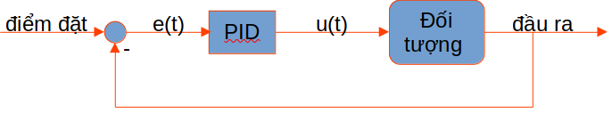
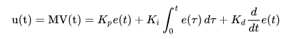

First, we need to understand the problem, model the joystick system, the input and output factors and the control goal.
## I. Examining the problem

After creating the map, obviously, the purpose of the control is to keep the car at a steady speed without being thrown out of the lane. With such conditions, our vehicle system is analyzed as follows:

The two inputs that help us control the car are the throttle level and the steering angle. At the output side, through image processing algorithms, we will have information about the lane (the rightmost point on the side). left and right side of the lane).

Therefore, the vehicle controller needs to continuously calculate the throttle and steering angle values ​​to keep the vehicle in the lane, i.e. the center point of the camera (which is the center of the vehicle) must be between the left and right points of the lane. .

In order for the vehicle to stay in the lane and achieve the best speed, there are many control options that can be applied, but it is necessary to provide the kinematic equation related to the vehicle (the relationship between input and output). ). If we simplify the problem, assuming we fix the speed to be a constant (set the throttle to be fixed) and only control the steering angle, then a simple controller can be applied to keep the car from deviating from the vehicle. lane. For example the below PID controller.

## II. PID controller design

PID stands for three basic components in a controller, including amplification (P), integral (I) and differential (D).

In this problem, we need to control the vehicle to follow the lane, so the output will be the difference between the center of the vehicle and the center of the lane. If the deviation is 0, the vehicle will always go in the middle of the lane, so set
- Setpoint is 0.
- Control error e = set point - output.
- The vehicle control signal is u which is the steering angle.

For the controller to achieve the best quality, we run simulations and calibrate the parameters Kp, Ki and Kd. The video below shows how to calibrate these parameters.

 