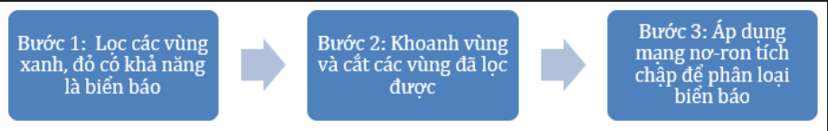
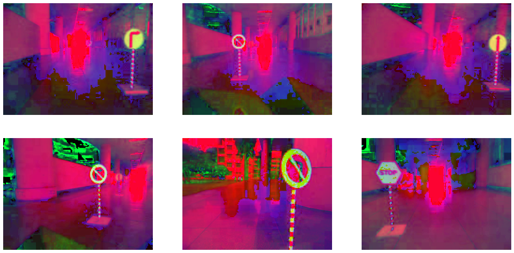

Ở [phần 1 Hello VIA!](https://via.makerviet.org/vi/docs/autonomous-on-simulation/hello-via/), chúng ta đã làm quen với việc xây dựng xe tự lái trên giả lập VIA. Trong phần này, chúng ta sẽ tìm hiểu về phát hiện biển báo giao thông. Chúng ta sẽ áp dụng các kỹ thuật xử lý ảnh và mạng nơ-ron để phát hiện và phân loại 6 loại biển báo giao thông (dừng, rẽ trái, rẽ phải, cấm rẽ trái, cấm rẽ phải, và đi thẳng).


Như ở phần trước, chúng tôi cũng chuẩn bị Notebook Colab để bạn có thể thực hành:

[link](https://colab.research.google.com/github/makerviet/hello-via/blob/master/notebooks/05-Phat-hien-bien-bao.ipynb).

**Thuật toán phát hiện và phân loại biển báo giao thông gồm 3 bước:**



Ở bước 1, ảnh sẽ được đưa qua bộ lọc màu để chọn ra các vùng màu xanh hoặc đỏ, có thể là biển báo giao thông. Sau đó, các vùng này được cắt thành các vùng nhỏ hơn ở bước 2 và đưa vào mạng nơ-ron tích chập để phân loại ở bước 3 để xác định loại biển báo giao thông hoặc các vật thể không xác định.

Khai báo các thư viện cần thiết


```python
import cv2
import math
import numpy as np
import matplotlib.pyplot as plt
from google.colab.patches import cv2_imshow
```

Trong ảnh thực tế, màu sắc của các vật thể thường có sự khác biệt do điều kiện ánh sáng hoặc bóng đổ. Để lọc các vật thể theo màu, chúng thường chuyển ảnh sang không gian màu HSV, nơi kênh màu được cô lập, dễ dàng chọn màu cụ thể. Chúng tôi cũng chuyển đổi ảnh của mình sang không gian màu HSV và sử dụng các khoảng để chọn các ứng viên biển báo giao thông theo màu của chúng.

Chúng ta sẽ dùng một số ảnh để thử nghiệm thuật toán. Các ảnh mẫu được đóng góp bởi các thành viên của [nhóm ICT K60, Đại học Bách Khoa Hà Nội](https://aicurious.io/posts/chung-toi-da-xay-dung-xe-tu-hanh-tren-gia-lap-the-nao).


### Tải dữ liệu thử nghiệm

```python
# Chúng ta sẽ tải một số ảnh để tiện cho việc demo thuật toán cũng như làm mọi việc ở đây trở lên dễ hiểu hơn
!wget https://github.com/makerhanoi/via-course-ai/raw/master/content/images/traffic_sign_images.zip
!unzip traffic_sign_images.zip
```

    --2021-12-01 18:01:17--  https://github.com/makerhanoi/via-course-ai/raw/master/content/images/traffic_sign_images.zip
    Resolving github.com (github.com)... 140.82.113.3
    Connecting to github.com (github.com)|140.82.113.3|:443... connected.
    HTTP request sent, awaiting response... 302 Found
    Location: https://raw.githubusercontent.com/makerhanoi/via-course-ai/master/content/images/traffic_sign_images.zip [following]
    --2021-12-01 18:01:17--  https://raw.githubusercontent.com/makerhanoi/via-course-ai/master/content/images/traffic_sign_images.zip
    Resolving raw.githubusercontent.com (raw.githubusercontent.com)... 185.199.111.133, 185.199.110.133, 185.199.109.133, ...
    Connecting to raw.githubusercontent.com (raw.githubusercontent.com)|185.199.111.133|:443... connected.
    HTTP request sent, awaiting response... 200 OK
    Length: 129341 (126K) [application/zip]
    Saving to: ‘traffic_sign_images.zip’
    
    traffic_sign_images 100%[===================>] 126.31K  --.-KB/s    in 0.02s   
    
    2021-12-01 18:01:18 (6.01 MB/s) - ‘traffic_sign_images.zip’ saved [129341/129341]
    
    Archive:  traffic_sign_images.zip
      inflating: 1.jpg                   
      inflating: 2.jpg                   
      inflating: 3.jpg                   
      inflating: 4.jpg                   
      inflating: 5.jpg                   
      inflating: 6.jpg                   
    

### Hiện ảnh

Hàm show_images() được chúng tôi viết sẵn để hiện ảnh trên notebook này, nó sẽ giúp chúng ta hiện nhiều ảnh cùng lúc trên file Notebook. Việc hiện ảnh trên các Notebook của Colab được thực hiện với hàm plt.imshow() từ thư viện matplotlib.


```python
def show_images(images, cmap="viridis"):
    column = 3
    row = int(math.ceil(len(images)/column))
    plt.figure(figsize=(20, 10))
    for i, img in enumerate(images):
        plt.subplot(row,column,i+1)
        if cmap != "gray":
            img = cv2.cvtColor(img, cv2.COLOR_BGR2RGB)
        plt.imshow(img, cmap=cmap)
        plt.axis('off')
```


```python
# Đọc hình ảnh
image_names = range(1,7)
print(image_names)
bgr_images = [cv2.imread(str(name) + ".jpg") for name in image_names]
show_images(bgr_images)
```

    range(1, 7)
    

    
## Bước 1: Lọc màu

Để chuyển đổi các ảnh trên sang hệ màu HSV, trước khi thực hiện lọc theo màu sắc, ta sử dụng hàm `cv2.cvtColor()` đã được làm quen trong bài học xử lý ảnh cơ bản.


```python
# mảng hsv sẽ lưu các ảnh đã được chuyển đổi sang hệ màu hsv
# sử dụng hàm cv2.cvtColor để convert ảnh từ dạng BGR sang HSV
hsvs = [cv2.cvtColor(img, cv2.COLOR_BGR2HSV) for img in bgr_images]
show_images(hsvs)
```



    

**Chọn ngưỡng màu thế nào?**

Sau khi chuyển ảnh sang hệ màu HSV, ta sẽ khảo sát và chọn ngưỡng màu để lọc ra các màu sắc cần thiết. Mỗi khoảng màu cần lọc sẽ bao gồm một ngưỡng dưới (lower) và một ngưỡng trên (upper).

Với các đối tượng có màu đỏ, ta lọc bằng 2 khoảng màu khác nhau:

```Python
lower1, upper1 = np.array([0,70,50]), np.array([10,255,255])
lower2, upper2 = np.array([170,70,50]), np.array([180,255,255])
```

Với các đối tượng có màu xanh dương:

```Python
lower3, upper3 = np.array([85,50,200]), np.array([135,250,250])
```

Thông qua hàm `filter_signs_by_color()` ta sẽ thu được một mặt nạ lọc, là một hình ảnh nhị phân có kích thước bằng kích thước ảnh ban đầu. Các điểm ảnh trong mặt nạ này sẽ có 2 giá trị là 0 (điểm ảnh tương ứng trong ảnh gốc không nằm trong khoảng màu cần lọc) và 255 (điểm ảnh tương ứng trong ảnh gốc nằm trong khoảng màu cần lọc).

```python
def filter_signs_by_color(image):
    """Lọc các đối tượng màu đỏ và màu xanh dương - Có thể là biển báo.
        Ảnh đầu vào là ảnh màu BGR
    """
    # Chuyển ảnh sang hệ màu HSV
    image = cv2.cvtColor(image, cv2.COLOR_BGR2HSV)

    # Lọc màu đỏ cho stop và biển báo cấm
    lower1, upper1 = np.array([0, 70, 50]), np.array([10, 255, 255])
    lower2, upper2 = np.array([170, 70, 50]), np.array([180, 255, 255])
    mask_1 = cv2.inRange(image, lower1, upper1) # dải màu đỏ thứ nhất
    mask_2 = cv2.inRange(image, lower2, upper2) # dải màu đỏ thứ hai
    mask_r = cv2.bitwise_or(mask_1, mask_2) # kết hợp 2 kết quả từ 2 dải màu khác nhau

    # Lọc màu xanh cho biển báo điều hướng
    lower3, upper3 = np.array([85, 50, 200]), np.array([135, 250, 250])
    mask_b = cv2.inRange(image, lower3,upper3)

    # Kết hợp các kết quả
    mask_final  = cv2.bitwise_or(mask_r,mask_b)
    return mask_final
```

```python
masks = [filter_signs_by_color(img) for img in bgr_images]
show_images(masks)
```


## Bước 2: Cắt và tìm các vật thể

Sau khi lọc các ứng viên biển báo giao thông theo màu, kết quả chứa tất cả các vật thể màu đỏ hoặc xanh, chẳng hạn như các biển báo, cột, hoặc các vùng nền. Trong bước tiếp theo, chúng ta cần lọc các vật thể nhiễu và tìm các hộp bao (bounding box) của biển báo giao thông. Chúng ta cũng nên áp dụng xử lý sau để lọc các vật thể quá nhỏ, quá lớn hoặc có tỷ lệ chiều rộng/chiều cao quá khác so với biển báo giao thông.

```python
def get_boxes_from_mask(mask):
    """Tìm kiếm hộp bao biển báo
    """
    bboxes = []

    nccomps = cv2.connectedComponentsWithStats(mask, 4, cv2.CV_32S)
    numLabels, labels, stats, centroids = nccomps
    im_height, im_width = mask.shape[:2]
    for i in range(numLabels):
        x = stats[i, cv2.CC_STAT_LEFT]
        y = stats[i, cv2.CC_STAT_TOP]
        w = stats[i, cv2.CC_STAT_WIDTH]
        h = stats[i, cv2.CC_STAT_HEIGHT]
        area = stats[i, cv2.CC_STAT_AREA]
        # Lọc các vật quá nhỏ, có thể là nhiễu
        if w < 20 or h < 20:
            continue
        # Lọc các vật quá lớn
        if w > 0.8 * im_width or h > 0.8 * im_height:
            continue
        # Loại bỏ các vật có tỷ lệ dài / rộng quá khác biệt
        if w / h > 2.0 or h / w > 2.0:
            continue
        bboxes.append([x, y, w, h])
    return bboxes
```

Ta tiến hành vẽ các kết quả lọc và tìm kiếm ở trên


```python
results = []
for i, img in enumerate(bgr_images):
    mask = filter_signs_by_color(img) # lọc theo màu sắc
    bboxes = get_boxes_from_mask(mask) # tìm kiếm khung bao của các vật từ mặt nạ màu sắc
    draw = img.copy() # Sao chép ảnh màu tương ứng để vẽ lên
    for bbox in bboxes:
        x, y, w, h = bbox
        # Vẽ khối hộp bao quanh biển báo
        cv2.rectangle(draw, (x,y), (x+w,y+h), (0,255,255), 4) # vẽ hình chữ nhật bao quanh vật
    results.append(draw)
show_images(results)
```


**Kết quả lọc màu. Vẫn còn một số kết quả dương tính giả (phát hiện nhầm). Chúng ta cần bộ phân loại để loại bỏ hoàn toàn các kết qủa nhầm lẫn này.**

## Bước 3: Phân loại biển báo

Sau khi lọc các biển báo theo màu sắc, việc tiếp theo chúng ta cần làm là phân loại chúng thành các biển báo khác nhau (biển dừng - stop, rẽ trái - left, rẽ phải - right, cấm rẽ trái - no_left, cấm rẽ phải - no_right, đi thẳng - straight). Các vật không phải biển báo cũng được nhận ra và phân loại thành đối tượng không xác định (unknown).

### Tìm hiểu về mạng nơ-ron tích chập (Convolutional neural network - CNN)

Mạng nơ-ron tích chập (Convolutional neural network - CNN) là một trong những mô hình học máy tiên tiến. Nó giúp cho chúng ta xây dựng được những hệ thống thông minh, thường dùng trong phân tích, nhận dạng hình ảnh với độ chính xác cao. Để tìm hiểu tại sao thuật toán này được sử dụng rộng rãi cho việc phân tích hình ảnh, chúng ta hãy cùng tìm hiểu về thuật toán này.

**Ma trận lọc học từ dữ liệu**

Trong bài học về các phép lọc ảnh, chúng ta đã được làm quen với các phép lọc sử dụng các bộ lọc tích chập. Chúng thực hiện nhân ma trận lọc với một cửa sổ trượt với toàn bộ ảnh. Các ma trận lọc khác nhau cho ta những ứng dụng khác nhau. Ví dụ với ma trận lọc trung bình, ma trận Gaussian ta có các bộ lọc giúp làm mịn ảnh. Với ma trận lọc Sobel, ta có bộ lọc giúp tìm các đường biên trong ảnh. Bằng việc thay đổi các trọng số trong các bộ lọc này, chúng ta trích xuất được các thông tin khác nhau từ hình ảnh đầu vào. Với việc kết hợp mạng nơ-ron nhân tạo vào phép nhân tích chập, chúng ta tạo ra các bộ lọc có khả năng "học" các trọng số này từ một lượng lớn dữ liệu. Các đặc trưng ngữ nghĩa được trích xuất bởi các bộ lọc này vượt xa các đặc trưng trích xuất bởi các bộ lọc được thiết kế bằng tay trong nhiều trường hợp, từ đó mở ra ứng dụng mới trong các bài toán thị giác máy.


**Minh họa việc nhân ma trận ảnh. Hình ảnh được lấy từ <https://github.com/vdumoulin/conv_arithmetic>**

**Cấu trúc của mạng nơ-ron tích chập**

Một mạng nơ-ron tích chập là một tập hợp các lớp tích chập (convolution) chồng lên nhau, ở giữa có thêm các hàm kích hoạt phi tuyến như sigmoid, ReLU. Mỗi một lớp tích chập sẽ tạo ra các thông tin trừu tượng hơn cho các lớp tiếp theo. Thông tin khi đi vào các lớp về sau càng có tính tổng hợp cao, trích xuất được các ý nghĩa quan trọng của hình ảnh.

Trong quá trình huấn luyện một mạng nơ-ron tích chập, đưa hình ảnh đi qua toàn bộ mạng, sau đó cập nhật các trọng số (các tham số của các bộ lọc) dựa vào thuật toán lan truyền ngược - backpropagation. Các bạn có thể tham khảo về thuật toán này tại [Wikipedia](https://vi.wikipedia.org/wiki/Truy%E1%BB%81n_ng%C6%B0%E1%BB%A3c). Thật may mắn, quá trình lan truyền ngược và cập nhật trọng số đều đã được cài đặt trong các thư viện học máy, học sâu phổ biến như Tensorflow hay PyTorch, từ đó giúp chúng ta huấn luyện được các mạng nơ-ron tích chập dễ hàng hơn.

**Xây dựng mạng nơ-ron tích chập để phân loại biển báo**

Chúng ta có thể ứng dụng các thiết kế của mạng nơ-ron tích chập để xây dựng một mô hình phân loại biển báo. Đầu vào của mạng phân loại là hình ảnh, đi qua nhiều lớp tích chập để trích xuất các đặc trưng phục vụ phân loại. Ta ghép thêm vào đó các lớp kết nối fully connected và cuối cùng là đưa ra kết quả dự đoán cho các biển báo, trả lời câu hỏi: đối tượng vừa đưa vào thuộc loại biển báo nào?

Hình ảnh sau mô tả được kiến trúc mạng nơ-ron tích chập chúng ta sẽ xây dựng.


### Thử nghiệm với mô hình huấn luyện sẵn

Chúng tôi đã thực hiện huấn luyện sẵn một mô hình phân loại biển báo bằng kiến trúc mạng nơ-ron tích chập [LeNet](https://en.wikipedia.org/wiki/LeNet), xây dựng bởi nhà khoa học **Yann LeCun** năm 1989. Chúng ta sẽ tải về và thử nghiệm mô hình này trước khi tự xây dựng và huấn luyện một mô hình.


```python
# Tải về mô hình huấn luyện sẵn
!wget https://github.com/makerhanoi/via-course-ai/raw/master/content/pretrained_models/traffic_sign_classifier_lenet_v2.onnx
```

    --2021-12-01 18:04:10--  https://github.com/makerhanoi/via-course-ai/raw/master/content/pretrained_models/traffic_sign_classifier_lenet_v2.onnx
    Resolving github.com (github.com)... 140.82.114.3
    Connecting to github.com (github.com)|140.82.114.3|:443... connected.
    HTTP request sent, awaiting response... 302 Found
    Location: https://raw.githubusercontent.com/makerhanoi/via-course-ai/master/content/pretrained_models/traffic_sign_classifier_lenet_v2.onnx [following]
    --2021-12-01 18:04:10--  https://raw.githubusercontent.com/makerhanoi/via-course-ai/master/content/pretrained_models/traffic_sign_classifier_lenet_v2.onnx
    Resolving raw.githubusercontent.com (raw.githubusercontent.com)... 185.199.108.133, 185.199.109.133, 185.199.110.133, ...
    Connecting to raw.githubusercontent.com (raw.githubusercontent.com)|185.199.108.133|:443... connected.
    HTTP request sent, awaiting response... 200 OK
    Length: 458035 (447K) [application/octet-stream]
    Saving to: ‘traffic_sign_classifier_lenet_v2.onnx’
    
    traffic_sign_classi 100%[===================>] 447.30K  --.-KB/s    in 0.03s   
    
    2021-12-01 18:04:10 (12.6 MB/s) - ‘traffic_sign_classifier_lenet_v2.onnx’ saved [458035/458035]
    
    


```python
# Nạp mô hình bằng OpenCV
model = cv2.dnn.readNetFromONNX("traffic_sign_classifier_lenet_v2.onnx")

# Hàm phát hiện biển báo
def detect_traffic_signs(img, model, draw=None):
    """Phát hiện biển báo
    """

    # Các lớp biển báo
    classes = ['unknown', 'left', 'no_left', 'right',
               'no_right', 'straight', 'stop']

    # Phát hiện biển báo theo màu sắc
    mask = filter_signs_by_color(img)
    bboxes = get_boxes_from_mask(mask)

    # Tiền xử lý
    img = cv2.cvtColor(img, cv2.COLOR_BGR2RGB)
    img = img.astype(np.float32)
    img = img / 255.0

    # Phân loại biển báo dùng CNN
    signs = []
    for bbox in bboxes:
        # Cắt vùng cần phân loại
        x, y, w, h = bbox
        sub_image = img[y:y+h, x:x+w]

        if sub_image.shape[0] < 20 or sub_image.shape[1] < 20:
            continue

        # Tiền xử lý
        sub_image = cv2.resize(sub_image, (32, 32))
        sub_image = np.expand_dims(sub_image, axis=0)

        # Sử dụng CNN để phân loại biển báo
        model.setInput(sub_image)
        preds = model.forward()
        preds = preds[0]
        cls = preds.argmax()
        score = preds[cls]

        # Loại bỏ các vật không phải biển báo - thuộc lớp unknown
        if cls == 0:
            continue

        # Loại bỏ các vật có độ tin cậy thấp
        if score < 0.9:
            continue

        signs.append([classes[cls], x, y, w, h])

        # Vẽ các kết quả
        if draw is not None:
            text = classes[cls] + ' ' + str(round(score, 2))
            cv2.rectangle(draw, (x, y), (x+w, y+h), (0, 255, 255), 4)
            cv2.putText(draw, text, (x, y-5),
                        cv2.FONT_HERSHEY_SIMPLEX, 0.8, (0, 255, 0), 2)

    return signs

results = []
for i, img in enumerate(bgr_images):
    draw = img.copy()
    signs = detect_traffic_signs(img, model, draw=draw)
    results.append(draw)
show_images(results)

```


## Thử nghiệm với mô phỏng VIA

Hãy thử chạy phát hiện biển báo giao thông và phân loại biển báo giao thông đồng thời. Clone, chạy mã nguồn lái xe và chọn bản đồ biển báo giao thông từ mô phỏng để trải nghiệm mã của chúng tôi.

```python
git clone https://github.com/makerviet/hello-via
cd p2_traffic_sign_detection
pip install -r requirements.txt
python drive.py
```


Bạn có thể thấy rằng không có mã điều khiển (rẽ trái, rẽ phải) dựa trên kết quả phát hiện biển báo giao thông. Vì vậy, hãy xem nó như là bài tập của bạn. Thiết kế một bản đồ đơn giản trước, sử dụng kết quả phát hiện biển báo giao thông và suy nghĩ về một số quy tắc để đánh lái vào thời điểm thích hợp.


## Nâng cao: Huấn luyện mô hình phân loại biển báo giao thông của riêng bạn

Huấn luyện một mô hình AI của riêng bạn là điều khá thú vị. Nếu bạn muốn đào sâu vào huấn luyện mô hình, chúng tôi đã chuẩn bị cho bạn một notebook để bạn có thể sử dụng để huấn luyện một bộ phân loại biển báo giao thông và chuyển đổi mô hình sang định dạng ONNX để sử dụng với OpenCV DNN.

**Truy cập sổ tay huấn luyện:**

[https://colab.research.google.com/github/makerviet/hello-via/blob/master/notebooks/Traffic-Sign-Classifier-Training.ipynb](https://colab.research.google.com/github/makerviet/hello-via/blob/master/notebooks/Traffic-Sign-Classifier-Training.ipynb).
