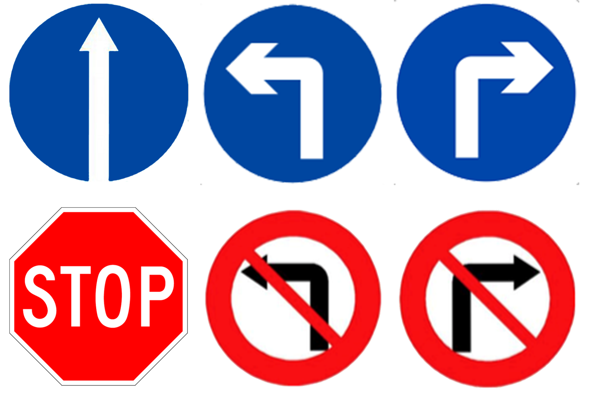
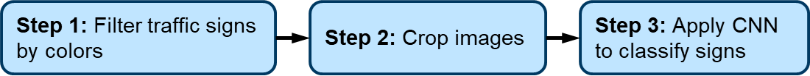
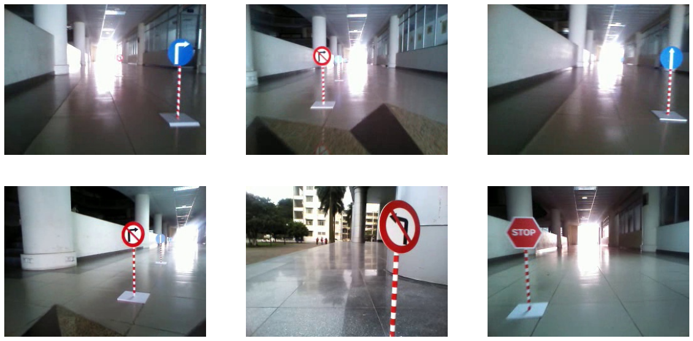
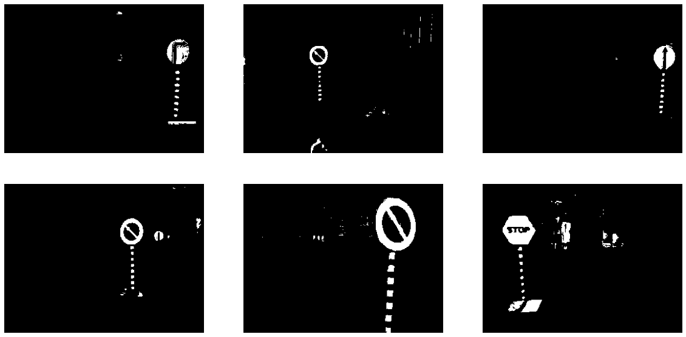
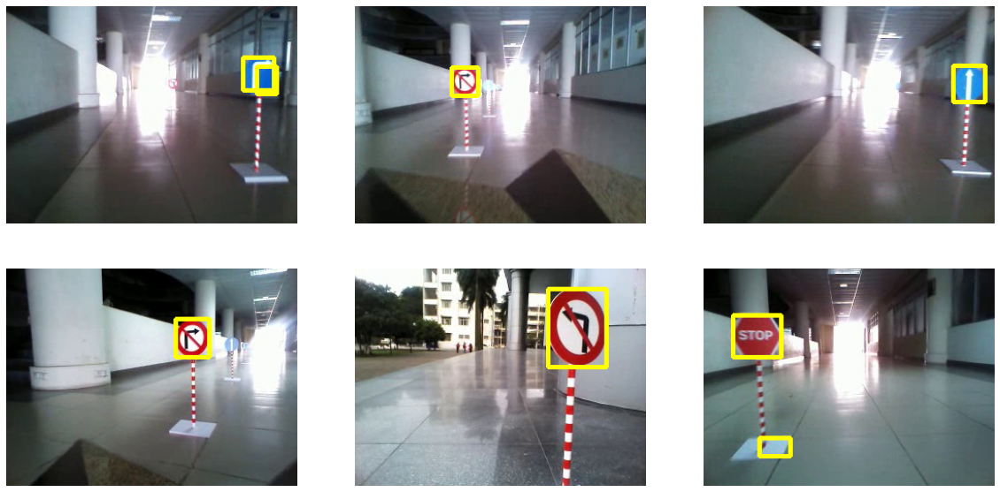
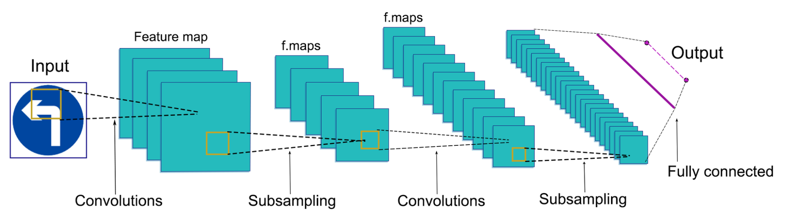
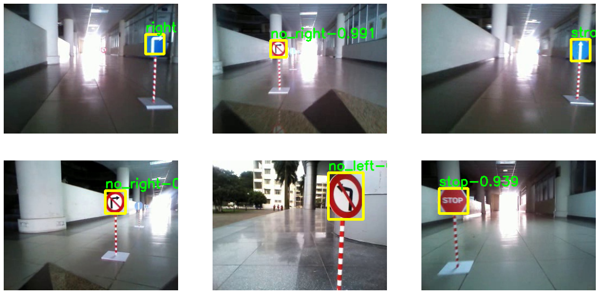

Ở [phần 1 Hello VIA!](/vi/docs/autonomous-on-simulation/hello-via/), chúng ta đã làm quen với việc xây dựng xe tự lái trên giả lập VIA. Trong phần này, chúng ta sẽ tìm hiểu về phát hiện biển báo giao thông. Chúng ta sẽ áp dụng các kỹ thuật xử lý ảnh và mạng nơ-ron để phát hiện và phân loại 6 loại biển báo giao thông (dừng, rẽ trái, rẽ phải, cấm rẽ trái, cấm rẽ phải, và đi thẳng).



Như ở phần trước, chúng tôi cũng chuẩn bị Notebook Colab để bạn có thể thực hành:

[https://colab.research.google.com/github/makerviet/hello-via/blob/master/notebooks/Traffic-Sign-Detection.ipynb](https://colab.research.google.com/github/makerviet/hello-via/blob/master/notebooks/Traffic-Sign-Detection.ipynb).

**Thuật toán phát hiện và phân loại biển báo giao thông gồm 3 bước:**



Ở bước 1, ảnh sẽ được đưa qua bộ lọc màu để chọn ra các vùng màu xanh hoặc đỏ, có thể là biển báo giao thông. Sau đó, các vùng này được cắt thành các vùng nhỏ hơn ở bước 2 và đưa vào mạng nơ-ron tích chập để phân loại ở bước 3 để xác định loại biển báo giao thông hoặc các vật thể không xác định.

## Bước 1: Lọc màu

Trong ảnh thực tế, màu sắc của các vật thể thường có sự khác biệt do điều kiện ánh sáng hoặc bóng đổ. Để lọc các vật thể theo màu, chúng thường chuyển ảnh sang không gian màu HSV, nơi kênh màu được cô lập, dễ dàng chọn màu cụ thể. Chúng tôi cũng chuyển đổi ảnh của mình sang không gian màu HSV và sử dụng các khoảng để chọn các ứng viên biển báo giao thông theo màu của chúng.

Chúng ta sẽ dùng một số ảnh để thử nghiệm thuật toán. Các ảnh mẫu được đóng góp bởi các thành viên của [nhóm ICT K60, Đại học Bách Khoa Hà Nội](https://aicurious.io/posts/chung-toi-da-xay-dung-xe-tu-hanh-tren-gia-lap-the-nao).



Hàm OpenCV `cv2.cvtColor()` được sử dụng để chuyển đổi màu và `cv2.inRange()` được sử dụng để lọc màu quan tâm. Tất cả các bước lọc màu được kết hợp thành hàm `filter_signs_by_color()`.

```python
def filter_signs_by_color(image):
    """Filter all objects with red or blue color - traffic sign candidate
    """

    # Convert image to HSV color space
    image = cv2.cvtColor(image, cv2.COLOR_BGR2HSV)

    # Filter red. There are two range of red color
    lower1, upper1 = np.array([0, 70, 50]), np.array([10, 255, 255])
    lower2, upper2 = np.array([170, 70, 50]), np.array([180, 255, 255])
    mask_1 = cv2.inRange(image, lower1, upper1)
    mask_2 = cv2.inRange(image, lower2, upper2)
    mask_r = cv2.bitwise_or(mask_1, mask_2)

    # Filter blue color
    lower3, upper3 = np.array([100, 150, 0]), np.array([140, 255, 255])
    mask_b = cv2.inRange(image, lower3, upper3)

    # Combine the result
    mask_final = cv2.bitwise_or(mask_r, mask_b)
    return mask_final
```



## Bước 2: Cắt và tìm các vật thể

Sau khi lọc các ứng viên biển báo giao thông theo màu, kết quả chứa tất cả các vật thể màu đỏ hoặc xanh, chẳng hạn như các biển báo, cột, hoặc các vùng nền. Trong bước tiếp theo, chúng ta cần lọc các vật thể nhiễu và tìm các hộp bao (bounding box) của biển báo giao thông. Chúng ta cũng nên áp dụng xử lý sau để lọc các vật thể quá nhỏ, quá lớn hoặc có tỷ lệ chiều rộng/chiều cao quá khác so với biển báo giao thông.

```python
def get_boxes_from_mask(mask):
    """Find bounding boxes from color
    """
    bboxes = []

    nccomps = cv2.connectedComponentsWithStats(mask, 4, cv2.CV_32S)
    numLabels, labels, stats, centroids = nccomps
    im_height, im_width = mask.shape[:2]
    for i in range(numLabels):
        x = stats[i, cv2.CC_STAT_LEFT]
        y = stats[i, cv2.CC_STAT_TOP]
        w = stats[i, cv2.CC_STAT_WIDTH]
        h = stats[i, cv2.CC_STAT_HEIGHT]
        area = stats[i, cv2.CC_STAT_AREA]
        # Filter small objects
        # (width < 20 or height < 20)
        if w < 20 or h < 20:
            continue
        # Filter too large objects
        if w > 0.8 * im_width or h > 0.8 * im_height:
            continue
        # Remove objects with too different width/height ratio
        if w / h > 2.0 or h / w > 2.0:
            continue
        bboxes.append([x, y, w, h])
    return bboxes
```



**Kết quả lọc màu. Vẫn còn một số kết quả dương tính giả (phát hiện nhầm). Chúng ta cần bộ phân loại để loại bỏ hoàn toàn các kết qủa nhầm lẫn này.**

## Bước 3: Phân loại biển báo

Sau khi lọc các biển báo giao thông theo màu, bước tiếp theo chúng ta cần phân loại các biển báo giao thông. Chúng ta sẽ sử dụng mạng nơ-ron tích chập (Convolutional Neural Network - CNN) để phân loại các biển báo giao thông. CNN là một trong những mô hình học máy tiên tiến. Nó giúp ta xây dựng các hệ thống thông minh cho các nhiệm vụ nhận diện với độ chính xác cao. Bạn có thể tưởng tượng mỗi lớp tích chập trong CNN giống như một tập hợp các bộ lọc mà chúng ta đã sử dụng trước đó như bộ lọc trung bình, bộ lọc Gaussian hoặc bộ lọc Sobel. Tuy nhiên, các tham số kernel của các lớp CNN được học từ dữ liệu để trích xuất các đặc trưng hữu ích cho các tác vụ nhận diện hình ảnh. Bạn có thể tìm hiểu thêm về CNN từ [bài viết này](https://towardsdatascience.com/convolutional-neural-networks-explained-9cc5188c4939).

Đầu vào của mạng phân loại là một hình ảnh, sau đó hình ảnh sẽ được truyền qua một số lớp tích chập để trích xuất các đặc trưng cho phân loại. Sau đó, chúng ta thêm một số lớp kết nối đầy đủ để có được kết quả dự đoán. Kết quả cuối cùng trả lời câu hỏi: vật thể thuộc loại biển báo nào?



Thiết kế và huấn luyện mạng nơ-ron tích chập mất rất nhiều thời gian. Để cho bạn kết quả nhanh chóng, chúng tôi đã huấn luyện một mô hình phân loại biển báo giao thông dựa trên [LeNet](https://en.wikipedia.org/wiki/LeNet). Mô hình phân loại này có thể được tải vào OpenCV với hàm `cv2.dnn.readNetFromONNX()`. Chúng tôi cung cấp hàm `detect_traffic_signs()` để phân loại và nhận kết quả phân loại.

```python
def detect_traffic_signs(img, model, draw=None):
    """Detect traffic signs on and image
    """

    # Traffic sign classes. unknown means "not a traffic sign"
    classes = ['unknown', 'left', 'no_left', 'right',
               'no_right', 'straight', 'stop']

    # Detect traffic signs by color
    mask = filter_signs_by_color(img)
    bboxes = get_boxes_from_mask(mask)

    # Preprocess
    img = cv2.cvtColor(img, cv2.COLOR_BGR2RGB)
    img = img.astype(np.float32)
    img = img / 255.0

    # Classify signs using CNN
    signs = []
    for bbox in bboxes:
        # Crop sign area
        x, y, w, h = bbox
        sub_image = img[y:y+h, x:x+w]

        if sub_image.shape[0] < 20 or sub_image.shape[1] < 20:
            continue

        # Preprocess
        sub_image = cv2.resize(sub_image, (32, 32))
        sub_image = np.expand_dims(sub_image, axis=0)

        # Use CNN to get prediction
        model.setInput(sub_image)
        preds = model.forward()
        preds = preds[0]
        cls = preds.argmax()
        score = preds[cls]

        # Remove unknown objects
        if cls == 0:
            continue

        # Remove low confidence objects
        if score < 0.5:
            continue

        signs.append([classes[cls], x, y, w, h])

        # Draw prediction result
        if draw is not None:
            text = classes[cls] + ' ' + str(round(score, 2))
            cv2.rectangle(draw, (x, y), (x+w, y+h), (0, 255, 255), 4)
            cv2.putText(draw, text, (x, y-5),
                        cv2.FONT_HERSHEY_SIMPLEX, 0.8, (0, 255, 0), 2)

    return signs
```




## Thử nghiệm với mô phỏng VIA

Hãy thử chạy phát hiện biển báo giao thông và phân loại biển báo giao thông đồng thời. Clone, chạy mã nguồn lái xe và chọn bản đồ biển báo giao thông từ mô phỏng để trải nghiệm mã của chúng tôi.

```python
git clone https://github.com/makerviet/hello-via
cd self-driving-car-tutorial/p2_traffic_sign_detection
pip3 install -r requirements.txt
python3 drive.py
```


Bạn có thể thấy rằng không có mã điều khiển (rẽ trái, rẽ phải) dựa trên kết quả phát hiện biển báo giao thông. Vì vậy, hãy xem nó như là bài tập của bạn. Thiết kế một bản đồ đơn giản trước, sử dụng kết quả phát hiện biển báo giao thông và suy nghĩ về một số quy tắc để đánh lái vào thời điểm thích hợp.


## Nâng cao: Huấn luyện mô hình phân loại biển báo giao thông của riêng bạn

Huấn luyện một mô hình AI của riêng bạn là điều khá thú vị. Nếu bạn muốn đào sâu vào huấn luyện mô hình, chúng tôi đã chuẩn bị cho bạn một notebook để bạn có thể sử dụng để huấn luyện một bộ phân loại biển báo giao thông và chuyển đổi mô hình sang định dạng ONNX để sử dụng với OpenCV DNN.

**Truy cập sổ tay huấn luyện:**

[https://colab.research.google.com/github/makerviet/hello-via/blob/master/notebooks/Traffic-Sign-Classifier-Training.ipynb](https://colab.research.google.com/github/makerviet/hello-via/blob/master/notebooks/Traffic-Sign-Classifier-Training.ipynb).
