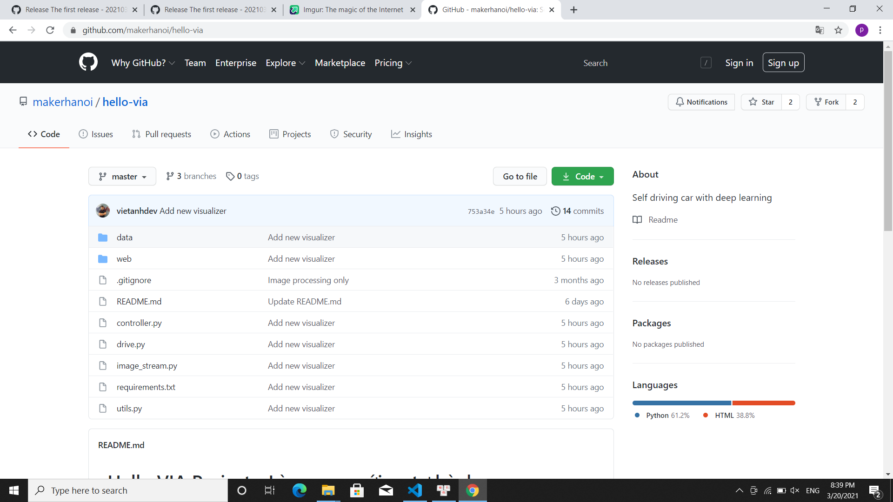
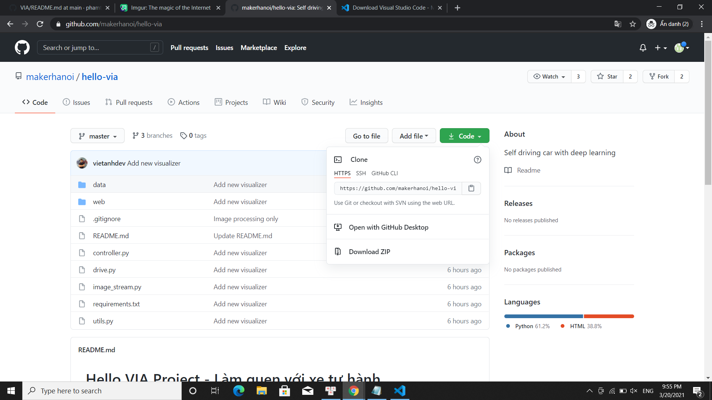
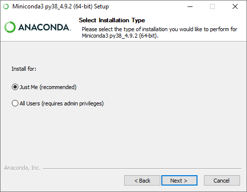
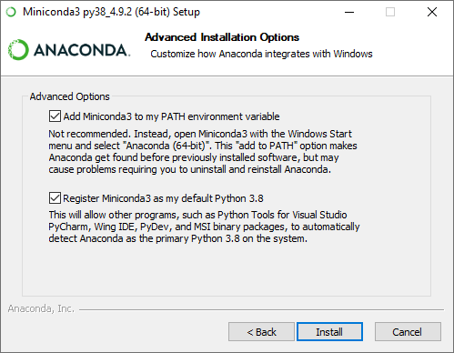
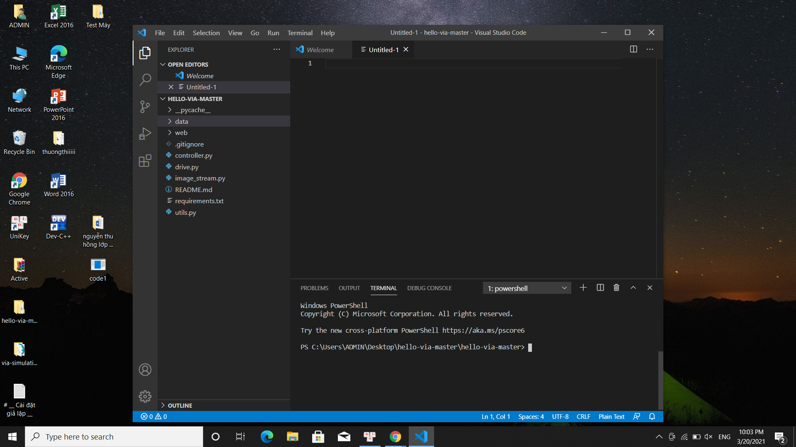
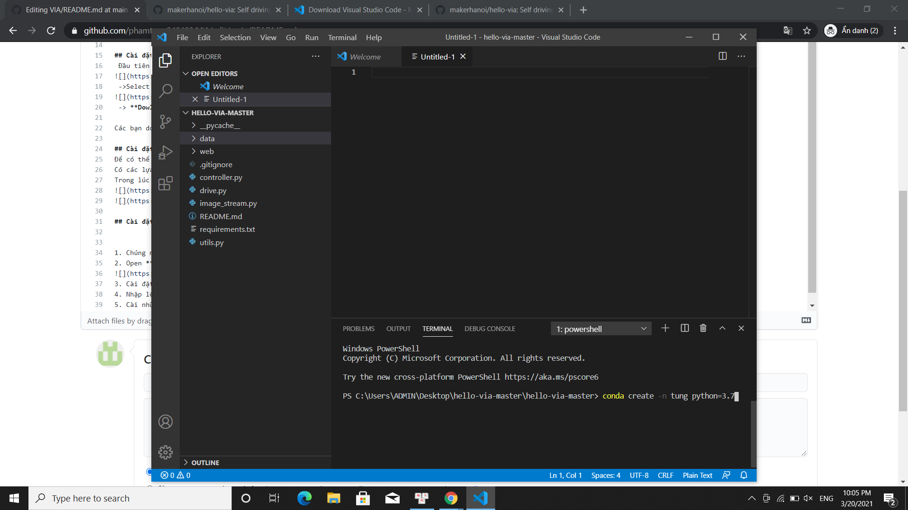
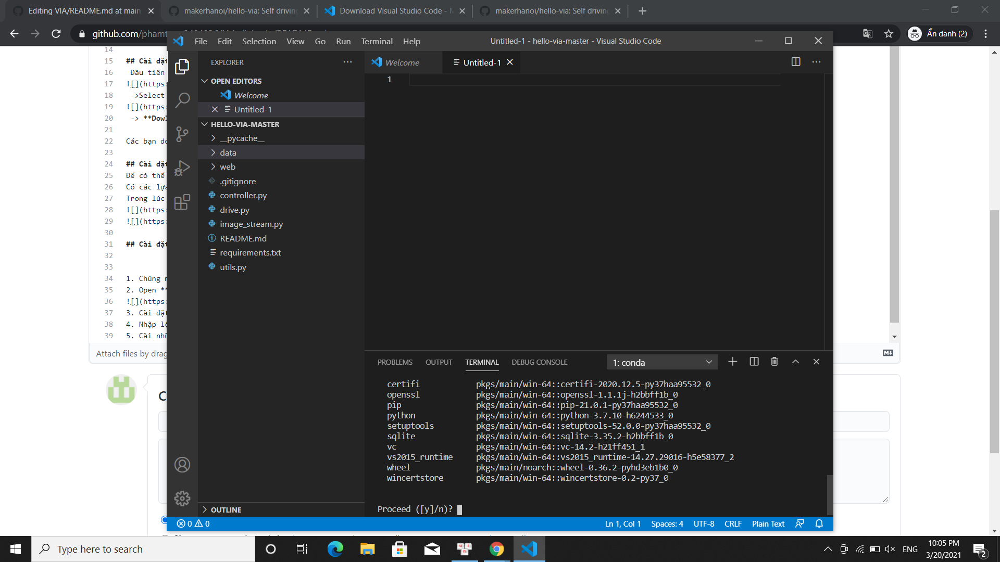

## I. Tải môi trường giả lập

Hiện nay, Maker Hà Nội đã xây dựng chương trình giả lập xe trên 3 hệ điều hành khác nhau : Linux, Windows, MacOS.
Tùy theo từng hệ điều hành các bạn sử dụng , các bạn có thể tải theo [link này](https://github.com/makerhanoi/via-simulation-jeep/releases/tag/v0.1-alpha "Github Maker Hanoi").

.

**Nếu bạn sử dụng hệ điều hành:**

* Windows → Chọn : `via-simulation-windows-x86_64-20210314.zip`
* Linux → Chọn : `via-simulation-linux-x86_64-20210314.zip`
* MacOS → Chọn : `via-simulation-macos-x86_64-20210314.zip` 

Các bạn tải các file zip về và giải nén file.

## II. Tải mã nguồn

Đầu tiên , các bạn [vào link này](https://github.com/makerhanoi/hello-via)



Chọn **Code**
 


Chọn **Dowload ZIP**

Các bạn tải file về và giải nén.

## III. Tải Miniconda 3

Để có thể khởi động mã nguồn điều khiển xe được xe, bạn cần cài đặt môi trường với [Miniconda 3](https://docs.conda.io/en/latest/miniconda.html).

Có các lựa chọn khác nhau, bạn tải theo hệ điều hành mình sử dụng, như mình sẽ chọn **Windows Installers → Python 3.8 → Miniconda 3 Windows 64-bit**.

Trong lúc cài đặt các bạn lưu ý một số thiết lập như sau.





Cuối cùng **Finish** để hoàn tất .

## IV. Thiết lập môi trường và chạy thử code

1. Chúng tôi sẽ sử dụng **Visual Studio Code** nên các bạn có thể dowload [ở đây](https://code.visualstudio.com/download "Visual Studio Code ").

2. Mở tệp  **File → Open Folder → hello-via-master** , các bạn sẽ thấy: 



3. Cài đặt môi trường giả lập Miniconda : **conda create -n <Tên môi trường> python=3.7**



 
 
 
**→ y → Enter**
 
 
4. Nhập lệnh **conda activate <Tên môi trường>** để khởi động môi trường:


5. Cài những gói cần thiết: **pip install -r requirements.txt**


6. Chạy mã điều khiển xe:

```
python drive.py
```

7. Bấm `START` trong giả lập và chọn bản đồ để xe chạy.

Như vậy chúng ta đã cùng cài đặt giả lập, môi trường và chạy thử code điều khiển xe cơ bản. Xem thêm về cách xây dựng các bản đồ mới tại đây: [/vi/docs/simulation/build-map/](/vi/docs/simulation/build-map/).