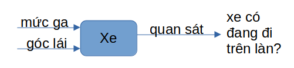
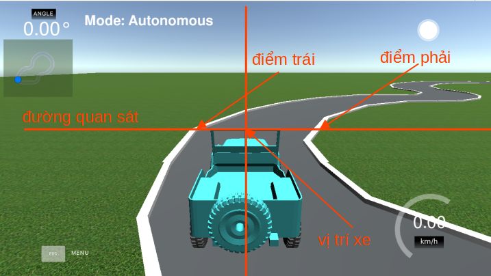
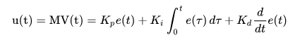

Trước tiên chúng ta cần tìm hiểu bài toán, mô hình hóa hệ thống cần điều khiển, các yếu tố đầu vào đầu ra và mục tiêu điều khiển. 
## I. Khảo sát bài toán

Sau khi tạo map, rõ ràng, mục đích của điều khiển chính là giữ cho xe có một tốc độ ổn định mà không bị văng ra khỏi làn đường. Với điều kiện như vậy, hệ thống xe của chúng ta được phân tích như sau:

Hai đầu vào giúp ta điều khiển xe là mức ga (throttle) và góc đánh lái (steering angle), ở phía đầu ra, thông qua các thuật toán xử lý ảnh, ta sẽ có thông tin về làn đường (điểm tận cùng bên trái và bên phải của làn). 

Vì vậy, bộ điều khiển xe cần tính toán liên tục các giá trị throttle và steering angle để giữ cho xe luôn trong làn đường, tức là điểm giữa của camera (chính là tâm xe) phải nằm ở giữa điểm trái và phải của làn.

Để xe có thể chạy trong làn và đạt vận tốc tốt nhất, có rất nhiều phương án điều khiển có thể áp dụng được, tuy nhiên cần cung cấp phương trình động học liên quan đến xe (mối liên hệ giữa đầu vào và đầu ra). Nếu đơn giản hóa bài toán, giả sử ta cố định vận tốc là hằng số (đặt throttle cố định) và chỉ điều khiển góc lái, khi đó có thể áp dụng một bộ điều khiển đơn giản để giữ cho xe luôn không lệch khỏi làn. Ví dụ như bộ điều khiển PID dưới đây. 

## II. Thiết kế bộ điều khiển PID

PID là chữ viết tắt của ba thành phần cơ bản có trong bộ điều khiển gồm khâu khuếch đại (P), khâu tích phân (I) và khâu vi phân (D). 

Trong bài toán này, ta cần điều khiển cho xe bám làn, vì vậy đầu ra sẽ thiết kế là sai lệch giữa tâm xe và tâm làn đường. Nếu sai lệch bằng 0 thì xe sẽ luôn đi giữa làn, vì vậy đặt 
- Điểm đặt bằng 0. 
- Sai lệch điều khiển e = điểm đặt - đầu ra. 
- Tín hiệu điều khiển xe là u chính là góc lái. 

Để bộ điều khiển đạt chất lượng tốt nhất, ta tiến hành chạy mô phỏng và hiệu chỉnh các tham số Kp,Ki và Kd. Video dưới đây hướng dẫn cách hiệu chỉnh các tham số này.

