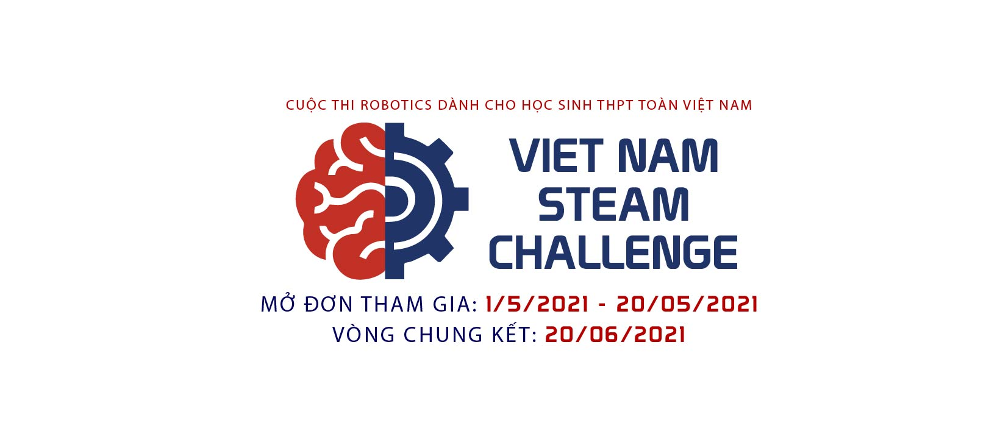

## 1. Thông báo từ BTC

- Buổi đào tạo tiếp theo: 20h30 - 06/06/2021.

Để chuẩn bị cho buổi đào tạo tiếp theo, và thực hiện các thử thách thú vị liên quan đến robot và trí tuệ nhân tạo, các đội chơi cần chuẩn bị sớm một số mạch và đồ dùng như sau:

- Mạch ESP32 - CAM: <https://bit.ly/3fFHPOe>.
- Robot khung tròn nhỏ hoặc 1 khung xe tương đương: <https://bit.ly/3plS8u8>.
- Tay cầm chơi game Sony PS2: <https://bit.ly/3ijm9ZM>.

## 2. Xem lại các buổi đào tạo

Dưới dây là video quay màn hình các buổi đào tạo của cuộc thi VSC 2021 phục vụ các đội xem lại. Các câu hỏi được gửi trực tiếp vào nhóm FB Messenger và sẽ được các mentor trả lời.

### Buối 1 (30/05/2021): Giới thiệu về AI

**Slides:** [slide-1-Intro-to-AI.pdf](/vi/docs/vsc-2021/thong-tin/slide-1-Intro-to-AI.pdf).

### Buổi 2 (31/05/2021):  Mạch VIA Makerbot

**Slides:** [slide-2-MakerBot.pdf](/vi/docs/vsc-2021/thong-tin/slide-2-MakerBot.pdf).



### Buổi 3 (02/06/2021): Thực hành code trên mạch Makerbot

**Slides:** [slide-3-MakerBot-code.pdf](/vi/docs/vsc-2021/thong-tin/slide-3-MakerBot-code.pdf).

