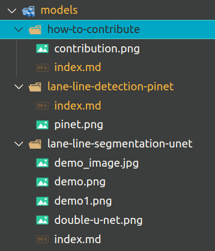

---

title: "Làm thế nào để đóng góp mô hình mới vào VIA-Models?"
description: "Bạn đang có những mô hình AI cho robot mới và muốn đóng góp cho cộng đồng VIA? Hãy đọc hướng dẫn sau để biết cách thức nhé!"
image: "contribution.png"
tags: ["Hướng dẫn"]
date: 2021-05-05
author: "vietanhdev"
---

Bạn đang có những mô hình AI cho robot mới và muốn đóng góp cho cộng đồng VIA? Hãy đọc hướng dẫn sau để biết cách thức nhé!

**Mô hình** được đề cập trong tài liệu này có thể là mô hình AI hoặc các thuật toán AI dựa trên xử lý ảnh, xử lý âm thanh và thực hiện một tác vụ nào đó, ví dụ nhận dạng biển báo giao thông, nhận dạng số đếm qua lời nói...

## 1. Clone mã nguồn của trang web này

Trước hết, bạn cần clone mã nguồn của trang web này bằng lệnh:

```
git clone https://github.com/makerhanoi/via-docs
```

Khi mở mã nguồn bằng phần mềm sửa mã như **Visual Studio Code**, bạn sẽ nhìn thấy thư mục chứa tài liệu của các mô hình AI tại [content/models](https://github.com/makerhanoi/via-docs/tree/master/content/models).

## 2. Tạo tài liệu về một mô hình mới

Để thêm mô hình mới, tạo thư mục chứa tài liệu mô hình bằng tiếng Anh, viết thường, ngăn cách nhau bởi dấu `-`, thể hiện tên chức năng chính của mô hình và tên mô hình gốc hoặc phương pháp chính được sử dụng để phát triển mô hình, ví dụ `lane-line-detection-pinet`. Tiếp đó tạo file `index.md` và sử dụng Markdown để soạn thảo nội dung về mô hình.

- Thêm các trường YAML ở đầu file `index.md` với format như sau:

```
---
title: "Phát hiện vạch kẻ đường - PiNet"
description: "Phát hiện vạch kẻ đường là bài toán rất quan trọng khi xây dựng xe tự hành. Mô hình phát hiện vạch kẻ đường dựa trên PiNet cho tốc độ cao và độ chính xác tương đối tốt cho các ứng dụng xe tự hành của VIA."
image: pinet.png
tags: ["Lane line"]
date: 2021-05-05
author: "Huỳnh Đức"
authorUrl: "https://github.com/ducnguyenhuynh/"
sourceCodeUrl: "https://github.com/ducnguyenhuynh/via-line-detection"
notebookUrl: "https://colab.research.google.com/drive/1Bn-9WOgkQuYMX0fIYu5ChkAQPQyHqhEo"
accuracy: "0.xx mAP"
fps: "xx FPS on NVIDIA RTX 2070"
version: "1.0"
---
```

Chỉnh sửa các trường phía trên theo thông tin mô hình của bạn.


### Một số lưu ý khi tạo tài liệu

- Hình ảnh, tệp sử dụng được để trực tiếp vào thư mục chứa file `index.md`. Không dùng hình ảnh bên ngoài hoặc mã base64.
- Các bạn có thể tham khảo các folder sau để làm mẫu: `content/models/lane-line-detection-pinet`.
- Kiến trúc các thư mục:




## 3. Soạn thảo file index.md

Tham khảo kiến trúc file mẫu tại [đây](/vi/models/how-to-contribute/index-sample.txt).

Toàn bộ file index.md nên được soạn bằng markdown thuần, hạn chế HTML.

## 4. Tạo pull request

Sau khi hoàn thành chỉnh sửa tài liệu, tạo pull request để cập nhật tài liệu.